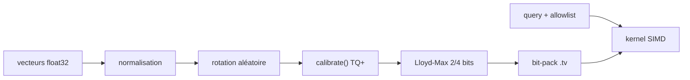

# RyanCodrai/turbovec

> Index vectoriel Rust quantifié, bindings Python, sans phase d'entraînement préalable.

## Le problème
Un corpus de 10 M de documents pèse 31 Go en float32, et les index PQ classiques
imposent un `train()` séparé avant de pouvoir ingérer.

## Ce que ça fait vraiment
Implémente TurboQuant (Google Research, ICLR 2026) : normalisation, rotation
orthogonale aléatoire, calibration par coordonnée optionnelle (TQ+), quantification
scalaire Lloyd-Max 2 ou 4 bits, bit-packing, puis rescoring par longueur pour
débiaiser le produit scalaire. Ingest en ligne sans train. Kernels SIMD écrits à la
main (NEON SDOT/SMMLA, AVX-512 VNNI, `vpermb`, repli AVX2 puis scalaire).
`sync(path)` persiste seulement le delta, un fsync par appel. Filtrage par allowlist
d'ids appliqué dans le kernel, par blocs de 32 vecteurs.

## Comment c'est branché


## Essayer
```bash
pip install turbovec
python3 benchmarks/download_data.py openai-1536
python3 benchmarks/suite/recall_d1536_2bit.py
cargo run --release --example insert_bench -- --dim 1536 --bits 2
```

## Coût et pièges
Gratuit, tout local, rien ne sort de la machine. `vectors` et `query` doivent être
des tableaux float32 2-D : les autres dtypes sont rejetés, pas convertis. Le
bénéfice du filtrage dépend de la sélectivité de l'allowlist.

## Ce que ce n'est pas
Pas une base vectorielle : ni serveur, ni métadonnées, ni requêtes SQL — un index
en mémoire avec persistance fichier. Les gains annoncés face à FAISS sont mesurés
par l'auteur sur deux machines GCP précises ; sur GloVe d=200, TurboQuant passe
derrière FAISS en 2 bits au-delà de k≈8. Aucune licence déclarée dans le README.

## Alternatives
- FAISS `IndexPQFastScan` : la référence de production comparée ici.
- `turboquant-py` : autre implémentation communautaire de TurboQuant.

## Pour toi
Le candidat sérieux pour un RAG local où la RAM est la contrainte — à tester après
avoir vérifié la licence.
