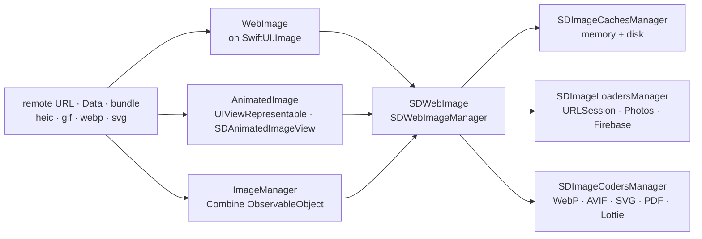

# SDWebImage/SDWebImageSwiftUI

> **Two SwiftUI views that load, cache and animate remote images across Apple platforms.**

## The problem

Showing a remote image in SwiftUI means handling the download, memory and disk caching,
cancellation when the view disappears, the loading indicator, and animated GIF or WebP
yourself. Apple's answer, `AsyncImage`, requires iOS 15+ and plays neither animated nor
vector images.

## What it actually does

The repository is a SwiftUI layer on top of SDWebImage, the Objective-C image loading
library. It ships three things and nothing else:

- `WebImage`, built on `SwiftUI.Image`: placeholder, progressive loading, indicator
  (`.indicator(.activity)`), transition (`.transition(.fade)`), `.onSuccess` / `.onFailure`
  callbacks, and since v2.0.0 animated image playback through `isAnimating`,
  `customLoopCount`, `playbackRate` and `playbackMode`.
- `AnimatedImage`, built on `UIViewRepresentable` / `NSViewRepresentable` over
  `SDAnimatedImageView`: progressive animation, vector images, UIKit tint colour, symbol
  images, `maxBufferSize`, and an `.onViewUpdate` hook down to the native view.
- `ImageManager`, a Combine `ObservableObject` you bind yourself with `@ObservedObject` when
  wiring your own view graph (`load(url:)` on appear, `cancel()` on disappear).

Everything else — cache, decoders, loaders — comes from SDWebImage and is configured in
`App.init()` or the `AppDelegate`: `SDImageCodersManager` for WebP/AVIF/SVG/PDF,
`SDImageCachesManager` for multiple caches, `SDImageLoadersManager` for Photos or Firebase
Storage. The README also states the repository is winding down: 3.x is the last dedicated
version, with the code moving into SDWebImage 6.0.

## How it is wired

No code-derived diagram exists for this repository; the graph below is rebuilt from the
README alone.



## Trying it

No terminal command is documented for everyday use: integration happens in Xcode. The
README gives these dependency declarations:

```ruby
pod 'SDWebImageSwiftUI'
```

```
github "SDWebImage/SDWebImageSwiftUI"
```

```swift
let package = Package(
    dependencies: [
        .package(url: "https://github.com/SDWebImage/SDWebImageSwiftUI.git", from: "3.0.0")
    ],
)
```

For the demo: open `SDWebImageSwiftUI.xcworkspace`, wait for SwiftPM to finish downloading,
pick the `SDWebImageSwiftUIDemo` scheme and run. For tests, run `pod install` at the root,
then use the `SDWebImageSwiftUITests` scheme.

## Cost and gotchas

- **Free, MIT licensed**, no API key, no mandatory third-party service. The cost is the
  Apple toolchain: Xcode 14+, iOS 14+, macOS 11+, tvOS 14+, watchOS 7+, visionOS 1+.
- **visionOS cannot be installed through a package manager**: since v3.0.0 it compiles, but
  neither CocoaPods nor SwiftPM is supported — use Xcode's built-in package dependency, or
  build the frameworks manually (clone SDWebImage, create `Carthage/Build/visionOS`, copy
  `SDWebImage.framework` into it).
- **iOS 13 was dropped** in v3.0.0; you must stay on the 2.x branch for it.
- **Backward deployment below iOS 14 is real work**: `-weak_framework SwiftUI
  -weak_framework Combine` in *every* third-party SwiftUI framework, `@available`
  annotations throughout, and below iOS 12.2 a hand-lowered minimum deployment target —
  SwiftPM supports neither weak linking nor Library Evolution.
- **A SwiftUI trap, not a library one**: inside `List` / `LazyStack` / `LazyGrid` a stateful
  view loses its state off screen, so the README requires extracting a dedicated sub-`View`.
  Likewise, inside a `Button` or `NavigationLink` you need
  `.buttonStyle(PlainButtonStyle())` or `.renderingMode(.original)` to avoid the tint overlay.
- **`.resizable()` is mandatory**, otherwise the view takes the bitmap's size.
- **Exotic formats are on you**: WebP, AVIF, SVG, PDF and Lottie go through coder plugins you
  register yourself at launch.

## What it is not

- **It is not an image loading engine.** Downloading, caching, request reuse and decoding
  live in SDWebImage; this repository only adapts it to SwiftUI. Any serious tuning happens
  in the parent project's API and wiki.
- **It is not a long-term project under this name**: the README announces 3.x as the final
  version of the dedicated repository before absorption into SDWebImage 6.0 through an
  automatic cross-module overlay.
- **It is not needed for iOS 15+ targets without animated images**: the README itself points
  to Apple's `AsyncImage` in that case.

## Alternatives

| | When to prefer it |
|---|---|
| **AsyncImage (SwiftUI, Apple)** | Pointed to by the README's very first line: iOS 15+/macOS 12+ and static images only. Prefer it to avoid a dependency when GIF, WebP and vector images are out of scope. |
| **onevcat/Kingfisher** | Credited in the README's thanks: the other image loading library of the Apple world, pure Swift end to end. Prefer it to avoid SDWebImage's Objective-C base; prefer SDWebImageSwiftUI for animated formats and the existing plugin ecosystem. |
| **SDWebImage/SDWebImage** | The underlying library itself, used directly from UIKit/AppKit — and eventually from SwiftUI too, since the merge is announced. |

The catalogue neighbours (`DaveWoodCom/XCGLogger`, `KeyboardKit/KeyboardKit`,
`SwifterSwift/SwifterSwift`, `yattee/yattee`) share the platform but not the subject: none
is comparable.

## For you

Little to do with day-to-day data / AI / MLOps work: this is Apple UI code. The one reason
to stop here would be an iOS or visionOS demo app showing inference output — image grids,
generated GIFs, SVG plots — where animated playback and disk caching save you from writing
the plumbing. Otherwise walk past, all the more so as the repository announces its own end
in favour of SDWebImage 6.0.
