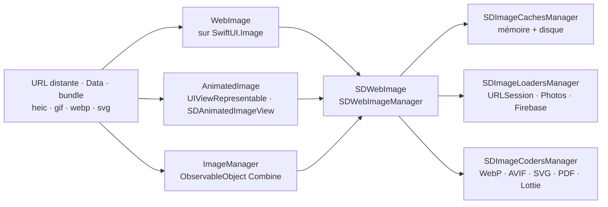

# SDWebImage/SDWebImageSwiftUI

> **Deux vues SwiftUI pour charger, cacher et animer des images distantes sur les plateformes Apple.**

## Le problème

Afficher une image distante dans SwiftUI suppose de gérer soi-même le téléchargement, le
cache mémoire et disque, l'annulation quand la vue disparaît, l'indicateur d'attente et le
cas du GIF ou du WebP animé. `AsyncImage`, la réponse d'Apple, exige iOS 15+ et ne joue
aucun format animé ni vectoriel.

## Ce que ça fait vraiment

Le dépôt est une couche SwiftUI posée sur SDWebImage, la bibliothèque Objective-C de
chargement d'images. Il expose trois choses et rien d'autre :

- `WebImage`, bâtie sur `SwiftUI.Image` : placeholder, chargement progressif, indicateur
  (`.indicator(.activity)`), transition (`.transition(.fade)`), rappels `.onSuccess` /
  `.onFailure`, et depuis la v2.0.0 la lecture d'images animées avec `isAnimating`,
  `customLoopCount`, `playbackRate`, `playbackMode`.
- `AnimatedImage`, bâtie sur `UIViewRepresentable` / `NSViewRepresentable` au-dessus de
  `SDAnimatedImageView` : animation progressive, images vectorielles, teinte UIKit, images
  symboles, `maxBufferSize`, et un `.onViewUpdate` pour redescendre à la vue native.
- `ImageManager`, un `ObservableObject` Combine à lier soi-même via `@ObservedObject` quand
  on veut brancher son propre graphe de vues (`load(url:)` à l'apparition, `cancel()` à la
  disparition).

Tout le reste — cache, décodeurs, chargeurs — vient de SDWebImage et se configure dans
`App.init()` ou l'`AppDelegate` : `SDImageCodersManager` pour WebP/AVIF/SVG/PDF,
`SDImageCachesManager` pour plusieurs caches, `SDImageLoadersManager` pour Photos ou
Firebase Storage. Le README annonce aussi que le dépôt est en fin de vie autonome : la
3.x est la dernière version dédiée, la suite fusionnant dans SDWebImage 6.0.

## Comment c'est branché

Aucun diagramme tiré du code n'existe pour ce dépôt ; ce schéma est reconstruit depuis le
seul README.



## Essayer

Aucune commande de terminal n'est documentée pour l'usage courant : l'intégration passe par
Xcode. Le README donne ces déclarations de dépendance :

```ruby
pod 'SDWebImageSwiftUI'
```

```
github "SDWebImage/SDWebImageSwiftUI"
```

```swift
let package = Package(
    dependencies: [
        .package(url: "https://github.com/SDWebImage/SDWebImageSwiftUI.git", from: "3.0.0")
    ],
)
```

Pour la démonstration : ouvrir `SDWebImageSwiftUI.xcworkspace`, attendre la fin du
téléchargement SwiftPM, choisir le schéma `SDWebImageSwiftUIDemo` et lancer. Pour les
tests, `pod install` à la racine puis le schéma `SDWebImageSwiftUITests`.

## Coût et pièges

- **Gratuit, licence MIT**, aucune clé d'API, aucun service tiers obligatoire. Le coût est
  celui de l'écosystème Apple : Xcode 14+, iOS 14+, macOS 11+, tvOS 14+, watchOS 7+,
  visionOS 1+.
- **visionOS n'est pas installable par gestionnaire de paquets** : depuis la v3.0.0 la
  compilation est possible, mais ni CocoaPods ni SwiftPM ne sont pris en charge — il faut
  passer par la dépendance de paquet intégrée à Xcode, ou construire les frameworks à la
  main (cloner SDWebImage, créer `Carthage/Build/visionOS`, y copier `SDWebImage.framework`).
- **iOS 13 est abandonné** depuis la v3.0.0 : il faut rester sur la branche 2.x.
- **Le déploiement rétroactif sous iOS 14 est un chantier** : `-weak_framework SwiftUI
  -weak_framework Combine` dans *tous* les frameworks SwiftUI tiers, annotations
  `@available` partout, et sous iOS 12.2 il faut abaisser la cible minimale à la main —
  SwiftPM ne sait faire ni le lien faible ni la Library Evolution.
- **Piège SwiftUI, pas de la bibliothèque** : dans `List` / `LazyStack` / `LazyGrid`, une
  vue à état perd son état hors écran ; le README impose d'extraire un sous-`View` dédié.
  De même, dans un `Button` ou un `NavigationLink`, il faut `.buttonStyle(PlainButtonStyle())`
  ou `.renderingMode(.original)` pour éviter la surcouche colorée.
- **`.resizable()` est obligatoire**, sinon la vue prend la taille du bitmap.
- **Formats exotiques à la charge de l'appelant** : WebP, AVIF, SVG, PDF, Lottie passent par
  des greffons de décodage à enregistrer soi-même au démarrage.

## Ce que ce n'est pas

- **Ce n'est pas un moteur de chargement d'images.** Le téléchargement, le cache, la
  réutilisation des requêtes et le décodage sont dans SDWebImage ; ce dépôt n'apporte que
  l'adaptation SwiftUI. Tout réglage sérieux se fait dans l'API et le wiki du projet parent.
- **Ce n'est pas un projet à long terme sous ce nom** : le README annonce la 3.x comme
  dernière version du dépôt dédié, avant absorption dans SDWebImage 6.0 via un recouvrement
  de modules automatique.
- **Ce n'est pas nécessaire si la cible est iOS 15+ sans image animée** : le README lui-même
  renvoie alors vers `AsyncImage` d'Apple.

## Alternatives

| | Quand le préférer |
|---|---|
| **AsyncImage (SwiftUI, Apple)** | Renvoyé par le README dès la première ligne : cible iOS 15+/macOS 12+ et images statiques seulement. À préférer pour éviter toute dépendance quand le GIF, le WebP et le vectoriel ne sont pas au programme. |
| **onevcat/Kingfisher** | Cité dans les remerciements du README : l'autre bibliothèque de chargement d'images du monde Apple, native Swift de bout en bout. À préférer si l'on ne veut pas traîner la base Objective-C de SDWebImage ; SDWebImageSwiftUI à préférer pour les formats animés et l'écosystème de greffons existant. |
| **SDWebImage/SDWebImage** | Le socle lui-même, à utiliser directement en UIKit/AppKit — et, à terme, en SwiftUI aussi, la fusion étant annoncée. |

Les voisins du catalogue (`DaveWoodCom/XCGLogger`, `KeyboardKit/KeyboardKit`,
`SwifterSwift/SwifterSwift`, `yattee/yattee`) partagent la plateforme mais pas le sujet :
aucun n'est comparable.

## Pour toi

Peu de rapport avec un quotidien data / IA / MLOps : c'est de l'interface Apple. Le seul
motif de s'y arrêter serait une application de démonstration iOS ou visionOS affichant des
sorties d'inférence — planches d'images, GIF générés, SVG de courbes — où la lecture
animée et le cache disque évitent d'écrire soi-même la plomberie. Sinon, passer son chemin,
d'autant que le dépôt annonce sa propre fin au profit de SDWebImage 6.0.
