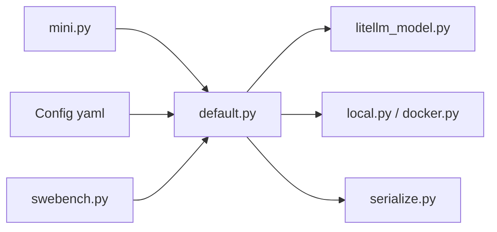

# SWE-agent/mini-swe-agent

> Agent de code minimal (bash seul, historique linéaire), pour la recherche et le quotidien.

## Le problème
Les agents de code sont des boîtes noires aux outils sur mesure, difficiles à auditer, à sandboxer et à fine-tuner.

## Ce que ça fait vraiment
Une centaine de lignes pour la classe agent : le LM propose une commande bash, exécutée via `subprocess.run`, et l'observation est ajoutée à l'historique.
Tous les modèles via litellm, OpenRouter, Portkey et Requesty, sans tool-calling requis.
Environnements local, Docker, Singularity, bubblewrap, SWE-ReX.
Lancements de benchmarks SWE-bench en lot et inspecteur de trajectoires.

## Comment c'est branché


## Essayer
```bash
pip install uv && uvx mini-swe-agent
pip install mini-swe-agent
mini
```

## Coût et pièges
Clé du fournisseur LLM à ta charge. Sans sandbox, les commandes s'exécutent en local.

## Ce que ce n'est pas
Pas un IDE ni un agent à outils riches : pour expérimenter des outils ou des processeurs d'historique, les auteurs recommandent SWE-agent.

## Alternatives
- SWE-agent : quand on veut des outils et interfaces spécifiques.

## Pour toi
À adopter comme base d'expérimentation d'agents et d'évaluation : le code se lit en entier, la trajectoire sert directement au fine-tuning, et il atteint plus de 74 % sur SWE-bench Verified.
