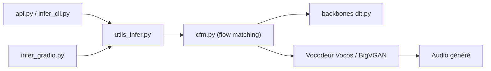

# SWivid/F5-TTS

> Modèle de synthèse vocale par flow matching qui clone une voix depuis un court audio de référence.

## Le problème
Produire une voix naturelle à partir d'un texte, dans le timbre d'un locuteur donné, sans entraîner un modèle par voix ni monter un pipeline TTS maison.

## Ce que ça fait vraiment
Le code génère de la parole conditionnée par un audio de référence et sa transcription (ou une transcription automatique si `--ref_text` est vide). `cfm.py` porte le flow matching, avec des backbones DiT, MMDiT ou UNet-T ; un vocodeur (Vocos, BigVGAN en option) convertit en audio. Le dépôt embarque aussi l'entraînement/finetuning (Accelerate), l'évaluation et un serving Triton + TensorRT-LLM (RTF 0,0394 mesuré par les auteurs sur un GPU L20).

## Comment c'est branché


## Essayer
```bash
conda create -n f5-tts python=3.11
conda activate f5-tts
pip install f5-tts
f5-tts_infer-gradio
f5-tts_infer-cli --model F5TTS_v1_Base \
--ref_audio "provide_prompt_wav_path_here.wav" \
--ref_text "The content, subtitle or transcription of reference audio." \
--gen_text "Some text you want TTS model generate for you."
```

## Coût et pièges
PyTorch doit correspondre à ton matériel (CUDA, ROCm, XPU, Apple Silicon) ; FFmpeg requis. Les checkpoints sont téléchargés depuis Hugging Face. Laisser `--ref_text` vide lance un ASR : mémoire GPU en plus.

## Ce que ce n'est pas
Ce n'est pas un service hébergé ni une API prête à l'emploi. La licence des poids n'est pas documentée dans le README (seul le code est MIT au catalogue). Rien sur l'encadrement de l'usage du clonage vocal.

## Alternatives
Le README ne cite pas d'autre dépôt concurrent ; il inclut lui-même E2 TTS, reproduction fidèle du papier, dans le même projet.

## Pour toi
Adopter : TTS zéro-shot installable par pip, avec CLI, Gradio et voie de serving GPU, code MIT ; vérifie seulement la licence des poids avant tout usage produit.

