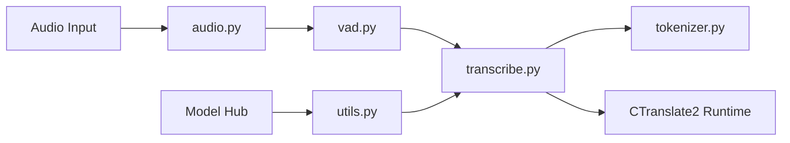

# SYSTRAN/faster-whisper

> Réimplémentation de Whisper sur CTranslate2 pour transcrire l'audio plus vite et avec moins de mémoire.

## Le problème
openai/whisper est lent et gourmand en VRAM ; transcrire de gros volumes audio coûte cher en temps GPU.

## Ce que ça fait vraiment
`WhisperModel` charge un modèle converti CTranslate2 (téléchargé du Hub) et renvoie des segments horodatés via un générateur.
Quantification int8 CPU/GPU, `BatchedInferencePipeline` pour le batch, timestamps au mot.
Filtre VAD Silero intégré ; décodage audio par PyAV (pas de FFmpeg système).
Script de conversion de tout Whisper compatible Transformers, y compris modèles affinés.

## Comment c'est branché


## Essayer
```bash
pip install faster-whisper
ct2-transformers-converter --model openai/whisper-large-v3 --output_dir whisper-large-v3-ct2 --copy_files tokenizer.json preprocessor_config.json --quantization float16
```

## Coût et pièges
Gratuit. GPU : cuBLAS + cuDNN 9 pour CUDA 12 ; pour CUDA 11, rétrograder ctranslate2. `segments` est paresseux : la transcription ne démarre qu'à l'itération.

## Ce que ce n'est pas
Pas un service de diarisation ni une API hébergée. Les benchmarks dépendent du beam size (5 ici, 1 chez openai/whisper).

## Alternatives
- openai/whisper : implémentation d'origine, plus simple mais plus lente.
- whisper.cpp : plus léger sur CPU.
- whisper-standalone-win (Purfview) : binaires prêts pour Windows.

## Pour toi
Adopter : la brique de transcription par défaut pour un pipeline audio → texte en Python, sous MIT et facile à quantifier.
