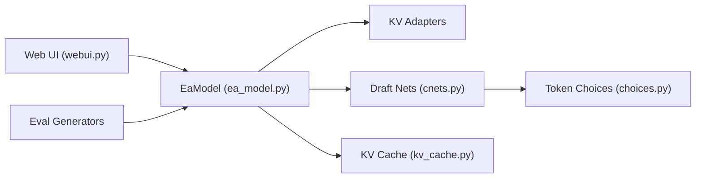

# SafeAILab/EAGLE

> Décodage spéculatif qui accélère la génération des LLM sans changer la distribution des textes produits.

## Le problème
La génération token par token est lente ; les modèles de 13 à 70 milliards de paramètres occupent longtemps le GPU.

## Ce que ça fait vraiment
Un petit modèle « draft » propose plusieurs tokens en arbre, que le modèle de base vérifie ; `eagenerate` remplace `generate` de Hugging Face. EAGLE-3 fusionne des caractéristiques de plusieurs couches. Le README annonce jusqu'à 5,6× sur Vicuna 13B (2 RTX 3090, fp16). Poids officiels pour Vicuna, LLaMA 2/3, Mixtral, Qwen2, DeepSeek-R1-Distill ; entraînement via DeepSpeed.

## Comment c'est branché


## Essayer
```bash
git clone https://github.com/SafeAILab/EAGLE.git
cd EAGLE
python -m venv ~/venvs/ea_env
source ~/venvs/ea_env/bin/activate
pip install -r requirements.txt
python -m eagle.evaluation.gen_ea_answer_llama3chat --ea-model-path yuhuili/EAGLE3-LLaMA3.1-Instruct-8B --base-model-path meta-llama/Llama-3.1-8B-Instruct --use_eagle3
```

## Coût et pièges
GPU indispensable. Le poids EAGLE doit correspondre au modèle de base ; les checkpoints non officiels varient. Modèles à accès restreint (Llama) : jeton Hugging Face. Les facteurs d'accélération sont ceux annoncés par les auteurs.

## Ce que ce n'est pas
Pas un serveur d'inférence : pour la production, le README recommande SpecForge (entraînement avec SGLang) et l'intégration vLLM.

## Alternatives
- Medusa, Lookahead : comparés dans le README.
- SpecForge : recommandé pour entraîner EAGLE-3.

## Pour toi
À adopter si tu sers des LLM sur GPU : méthode publiée (ICML, EMNLP, NeurIPS), reprise dans vLLM et SGLang, gain de latence mesurable sur tes propres modèles.
