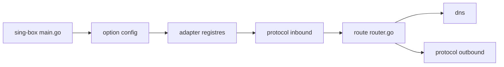

# SagerNet/sing-box

> Plateforme de proxy universelle : routage, DNS et nombreux protocoles sortants, pilotés par configuration.

## Le problème
Faire passer du trafic réseau par plusieurs protocoles de proxy avec des règles de routage et de DNS unifiées.

## Ce que ça fait vraiment
Le README ne tient qu'en deux lignes ; ce qui suit vient de l'architecture d'après le code. Un exécutable (`cmd/sing-box`) lit une configuration typée (`option/`), instancie entrées, sorties, DNS et services (`adapter/`), puis le moteur de routage (`route/`) choisit la sortie selon des règles (domaine, IP, processus, protocole). La documentation est hébergée à part.

## Comment c'est branché

## Essayer
Aucune commande documentée dans le README (renvoi vers https://sing-box.sagernet.org).

## Coût et pièges
Gratuit. Licence présente mais non identifiée par GitHub : à lire avant tout usage. 340 issues ouvertes.

## Ce que ce n'est pas
Ce n'est pas un outil clé en main : sans configuration détaillée il ne fait rien. Matière insuffisante ici pour juger la prise en main.

## Alternatives
Aucune alternative nommée dans le README.

## Pour toi
À ignorer pour un travail data/IA/MLOps : c'est de l'infrastructure réseau sans lien direct, et la licence est à vérifier.

