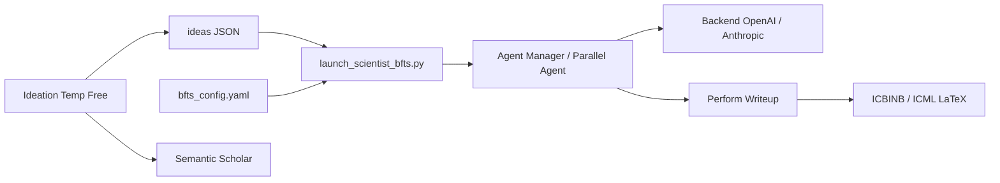

# SakanaAI/AI-Scientist-v2

> Pipeline agentique qui génère idées, expériences ML et article LaTeX, pour chercheurs curieux d'automatisation.

## Le problème
Explorer une idée de recherche ML demande idéation, code d'expérience, analyse et rédaction : des semaines de travail humain.

## Ce que ça fait vraiment
Un script d'idéation (`perform_ideation_temp_free.py`) produit des idées JSON à partir d'un sujet en Markdown, avec contrôle de nouveauté via Semantic Scholar.
`launch_scientist_bfts.py` lance une recherche arborescente best-first (config `bfts_config.yaml`) où des agents parallèles écrivent et exécutent du code.
Les résultats alimentent des modules de tracé, de relecture LLM/VLM et de rédaction sur gabarits LaTeX (ICBINB, ICML).
Le README prévient : taux de succès plus faible que v1, et le code écrit par le LLM est exécuté.

## Comment c'est branché


## Essayer
```bash
conda create -n ai_scientist python=3.11
conda activate ai_scientist
pip install -r requirements.txt
python ai_scientist/perform_ideation_temp_free.py --workshop-file "ai_scientist/ideas/my_research_topic.md" --model gpt-4o-2024-05-13 --max-num-generations 20 --num-reflections 5
python launch_scientist_bfts.py --load_ideas "ai_scientist/ideas/my_research_topic.json" --load_code --add_dataset_ref --model_writeup o1-preview-2024-09-12 --model_citation gpt-4o-2024-11-20 --model_review gpt-4o-2024-11-20 --model_agg_plots o3-mini-2025-01-31 --num_cite_rounds 20
```

## Coût et pièges
Linux + GPU NVIDIA/CUDA ; environ 15–20 $ par exécution d'expérience plus ~5 $ de rédaction selon le README, plusieurs heures.
Exécute du code généré par LLM : à lancer dans un bac à sable (Docker).

## Ce que ce n'est pas
Pas un générateur fiable d'articles : beaucoup d'exécutions n'aboutissent pas à un PDF.
Pas meilleur que v1 quand un bon gabarit existe. Licence non identifiée par GitHub.

## Alternatives
- AI Scientist-v1 : préférable pour des objectifs clairs avec un gabarit solide (taux de succès plus élevé).

## Pour toi
À surveiller : démonstrateur intéressant de boucle agentique d'expérimentation ML, mais coûteux, risqué à exécuter et à licence floue pour un usage réel.
