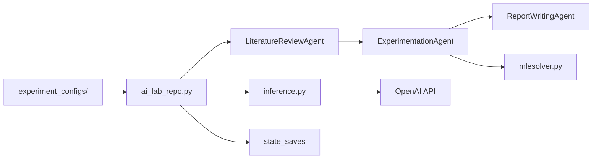

# SamuelSchmidgall/AgentLaboratory

> Chaîne d'agents LLM qui mène une recherche : revue de littérature, expériences, rédaction LaTeX.

## Le problème
Revue d'articles, préparation des données, code d'expérience et rédaction de rapport prennent la majorité du temps d'un chercheur.

## Ce que ça fait vraiment
Trois phases orchestrées par `ai_lab_repo.py` à partir d'une config YAML : littérature (arXiv), expérimentation (Python, Hugging Face), rapport (LaTeX).
Agents spécialisés par étape, solveurs `mlesolver.py` et `papersolver.py`.
Checkpoints dans `state_saves` pour reprendre ; mode copilote avec humain dans la boucle.
Compatible AgentRxiv, où les agents partagent leurs travaux.

## Comment c'est branché


## Essayer
```bash
git clone git@github.com:SamuelSchmidgall/AgentLaboratory.git
python -m venv venv_agent_lab
source venv_agent_lab/bin/activate
pip install -r requirements.txt
python ai_lab_repo.py --yaml-location "experiment_configs/MATH_agentlab.yaml"
```

## Coût et pièges
Facture LLM à ta charge, qui grimpe avec les modèles recommandés (o1) ; pdflatex optionnel.

## Ce que ce n'est pas
Pas un chercheur autonome fiable : le README parle d'une base de code avec « beaucoup de marge d'amélioration ». Le code généré s'exécute localement.

## Alternatives
Aucune alternative nommée dans le README.

## Pour toi
À surveiller : intéressant pour prototyper des baselines ML automatisées, mais code de recherche figé depuis plus d'un an, à cantonner à l'expérimentation.
