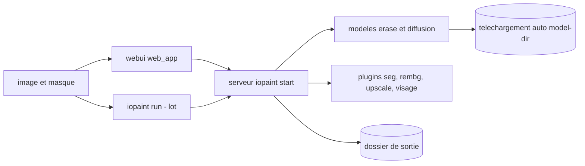

# Sanster/IOPaint

> **Local image retouching.** Erase an object, replace a region, extend a frame, with no online service.

## The problem

Without it, removing a passer-by, a watermark or a defect from an image means either manual
editing or an online service you must upload your images to. Wiring LaMa, a diffusion
inpainting model, a segmenter and a mask-drawing interface together yourself is plumbing this
project spares you.

## What it actually does

IOPaint is a self-hosted web service plus a batch command line. It downloads models
automatically at startup and exposes an interface where you paint a mask with the mouse. The
README documents three families of tasks: erasing (erase models such as LaMa), object
replacement and outpainting through diffusion models (stable-diffusion-inpainting, SDXL
inpainting, BrushNet, PowerPaintV2, Paint-by-Example), and drawing text into an image with
AnyText. Plugins add interactive segmentation (Segment Anything), background removal
(RemoveBG, Anime Segmentation), super resolution (RealESRGAN) and face restoration (GFPGAN,
RestoreFormer). A FileManager browses your pictures and writes to the output directory. Most
of the work is orchestration of third-party models; what belongs to the project itself is the
interface, the server and the command-line driver.

## How it is wired



Two entry points reach the same Python server: the web interface built with npm inside
`web_app` then copied into `iopaint/web_app`, and the `iopaint run` command for folders of
images and masks. The server loads the model asked for by `--model` on the device given by
`--device`, and fetches weights at startup into the directory set by `--model-dir`. Plugins
are switched on with launch options and have their own device flags.

## Trying it

```bash
# In order to use GPU, install cuda version of pytorch first.
# pip3 install torch==2.1.2 torchvision==0.16.2 --index-url https://download.pytorch.org/whl/cu118

pip3 install iopaint
iopaint start --model=lama --device=cpu --port=8080
```

Then visit `http://localhost:8080`. With a plugin:

```bash
iopaint start --enable-interactive-seg --interactive-seg-device=cuda
```

And in batch:

```bash
iopaint run --model=lama --device=cpu \
--image=/path/to/image_folder \
--mask=/path/to/mask_folder \
--output=output_dir
```

## Cost and traps

Free, self-hosted, no API key and no account: the README claims CPU, GPU and Apple Silicon
support. The cost sits elsewhere. First the PyTorch install: the CUDA (cu118) or ROCm build
must come *before*, and the README notes ROCm only works on Linux. Then the automatic weight
download at startup, whose size and disk footprint are not documented — only the `--model-dir`
option to change where it lands. The VRAM needed by the diffusion models is not documented
either; on CPU only feasibility is promised, not processing time. Front-end development needs
nodejs, `npm install`, `npm run build` and a manual copy of `dist/` into `iopaint/web_app`.

## What it is not

Not a general-purpose image editor: no layers, no color grading, only erase, inpaint,
outpaint and a few plugins. Not a model either: IOPaint trains nothing, it loads weights
published by others (Hugging Face, LaMa, SAM) and is worth what they are worth. The mask is
still your job, drawn by hand or supplied as a folder — automatic cut-out exists only as a
plugin. And self-hosted does not mean offline: the first startup downloads the models.

## Alternatives

huggingface/diffusers is the layer underneath: pick it if you want to write your own
inpainting pipeline in Python instead of using a ready-made interface — IOPaint consumes
models from that ecosystem. The other catalogue neighbours (transformers,
annotated_deep_learning_paper_implementations, ultralytics/yolov5) answer a different need:
no comparable turnkey inpainting tool in the catalogue.

## For you

Useful as a data-preparation brick: cleaning an image corpus, stripping watermarks or
anonymising elements before training, in batch and without sending images outside. The
`iopaint run` mode is what matters for a data profile; the web UI is only the shop window.
One caveat: a single visible maintainer behind a heavily used project.
