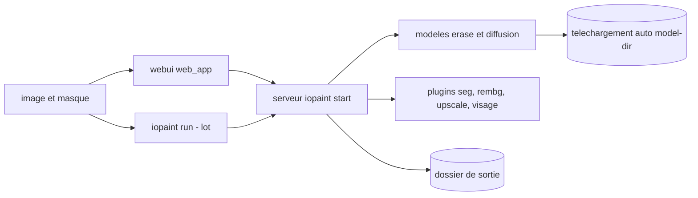

# Sanster/IOPaint

> **Retouche d'image locale.** Effacer un objet, remplacer une zone, étendre un cadre, sans service en ligne.

## Le problème

Sans lui, effacer un passant, un filigrane ou un défaut sur une image suppose soit un éditeur
manuel, soit un service en ligne payant à qui on envoie ses images. Assembler soi-même LaMa,
un modèle de diffusion d'inpainting, un segmenteur et une interface de masquage est un
travail de plomberie que le README évite d'avoir à refaire.

## Ce que ça fait vraiment

IOPaint est un service web à lancer chez soi, doublé d'une commande de traitement par lot.
Il télécharge les modèles automatiquement au démarrage et expose une interface où l'on peint
un masque à la souris. Trois familles de tâches sont documentées : effacement (modèles
« erase » comme LaMa), remplacement d'objet et outpainting via des modèles de diffusion
(stable-diffusion-inpainting, SDXL inpainting, BrushNet, PowerPaintV2, Paint-by-Example),
et écriture de texte dans l'image avec AnyText. Autour, des plugins ajoutent la segmentation
interactive (Segment Anything), le détourage de fond (RemoveBG, Anime Segmentation), la
super-résolution (RealESRGAN) et la restauration de visage (GFPGAN, RestoreFormer). Un
FileManager permet de parcourir ses images et d'écrire dans le dossier de sortie. Le gros du
travail est donc de l'orchestration de modèles tiers ; ce qui appartient en propre au projet,
c'est l'interface, le serveur et le pilotage par ligne de commande.

## Comment c'est branché



Deux entrées mènent au même serveur Python : l'interface web construite avec npm dans
`web_app` puis copiée dans `iopaint/web_app`, et la commande `iopaint run` pour les dossiers
d'images et de masques. Le serveur charge le modèle demandé par `--model`, sur le device
demandé par `--device`, et récupère les poids au démarrage dans le répertoire réglé par
`--model-dir`. Les plugins s'activent par des options au lancement, avec leur propre device.

## Essayer

```bash
# In order to use GPU, install cuda version of pytorch first.
# pip3 install torch==2.1.2 torchvision==0.16.2 --index-url https://download.pytorch.org/whl/cu118

pip3 install iopaint
iopaint start --model=lama --device=cpu --port=8080
```

Puis `http://localhost:8080`. Avec un plugin :

```bash
iopaint start --enable-interactive-seg --interactive-seg-device=cuda
```

Et en lot :

```bash
iopaint run --model=lama --device=cpu \
--image=/path/to/image_folder \
--mask=/path/to/mask_folder \
--output=output_dir
```

## Coût et pièges

Gratuit, auto-hébergé, sans clé d'API ni compte : le README insiste sur CPU, GPU et Apple
Silicon. Le coût est ailleurs. D'abord l'installation de PyTorch : la version CUDA (cu118) ou
ROCm doit être posée *avant*, et le README note que ROCm ne fonctionne que sous Linux. Ensuite
le téléchargement automatique des poids au démarrage, dont le README ne donne ni la taille ni
l'empreinte disque — seulement l'option `--model-dir` pour changer de destination. Enfin, la
VRAM nécessaire aux modèles de diffusion n'est pas documentée ; sur CPU, seul le principe est
garanti, pas le temps de traitement. Le développement front demande nodejs, `npm install`,
`npm run build` et une copie manuelle du `dist/` vers `iopaint/web_app`.

## Ce que ce n'est pas

Ce n'est pas un éditeur d'image généraliste : pas de calques, pas de retouche colorimétrique,
uniquement effacement, inpainting, outpainting et quelques plugins. Ce n'est pas non plus un
modèle : IOPaint n'entraîne rien, il charge des poids publiés par d'autres (Hugging Face,
LaMa, SAM) et vaut ce qu'ils valent. Le masque reste à la charge de l'utilisateur, à la souris
ou via un dossier de masques — le détourage automatique existe seulement en plugin. Enfin,
« self-hosted » ne veut pas dire hors-ligne : le premier démarrage télécharge les modèles.

## Alternatives

huggingface/diffusers est la couche en dessous : à préférer si l'on veut écrire son propre
pipeline d'inpainting en Python plutôt qu'utiliser une interface toute faite — IOPaint
consomme d'ailleurs des modèles de cet écosystème. Les autres voisins du catalogue
(transformers, annotated_deep_learning_paper_implementations, ultralytics/yolov5) ne
répondent pas au même besoin : aucune alternative comparable en outil d'inpainting clé en
main dans le catalogue.

## Pour toi

Utile comme brique de préparation de données : nettoyer un corpus d'images, retirer des
filigranes ou anonymiser des éléments avant entraînement, en lot et sans envoyer les images
dehors. Le mode `iopaint run` est ce qui intéresse un profil data ; l'interface web n'est que
la vitrine. Réserve : un seul mainteneur visible derrière un projet très utilisé.
