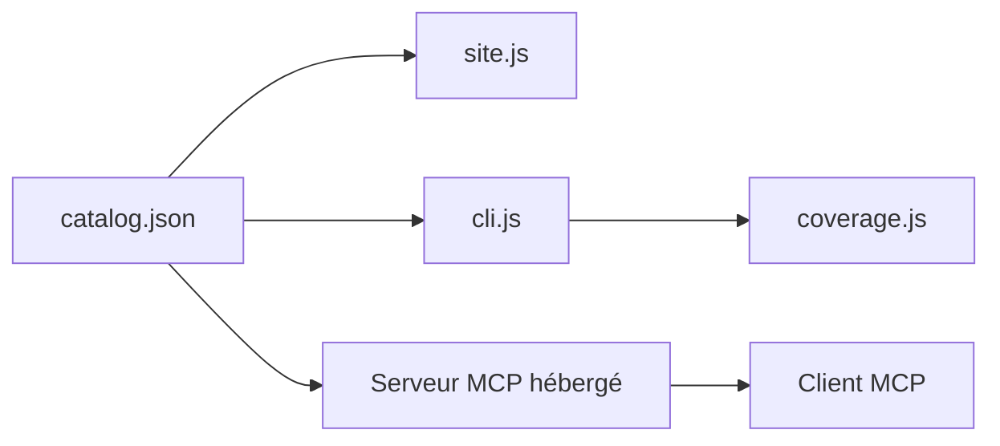

# SchemaStore/schemastore

> Catalogue communautaire de schémas JSON pour fichiers de config courants, avec un serveur MCP hébergé.

## Le problème
Valider ou compléter un fichier de config (package.json, workflows CI…) exige de retrouver le bon JSON Schema.

## Ce que ça fait vraiment
Dépôt de schémas indexés dans `catalog.json`, un site pour les parcourir, une CLI pour valider les schémas et mesurer la couverture. Un serveur MCP public (mcp.schemastore.org) permet à un assistant de chercher et récupérer des schémas ; son code n'est pas dans ce dépôt.

## Comment c'est branché


## Essayer
```json
{
  "servers": {
    "SchemaStore": {
      "url": "https://mcp.schemastore.org/",
      "type": "http"
    }
  }
}
```
À placer dans `.vscode/mcp.json`.

## Coût et pariés
Voir ci-dessous.

## Coût et pièges
Gratuit, financé par dons ; les entreprises sont invitées à sponsoriser. Le serveur MCP est un service tiers hébergé.

## Ce que ce n'est pas
Pas un validateur prêt à l'emploi : c'est la collection de schémas. Le MCP n'est pas auto-hébergeable d'après ce README.

## Alternatives
Aucune citée dans le README.

## Pour toi
Source de schémas fiable pour valider configs et pipelines : adopter, d'autant que l'éditeur la consomme déjà.

