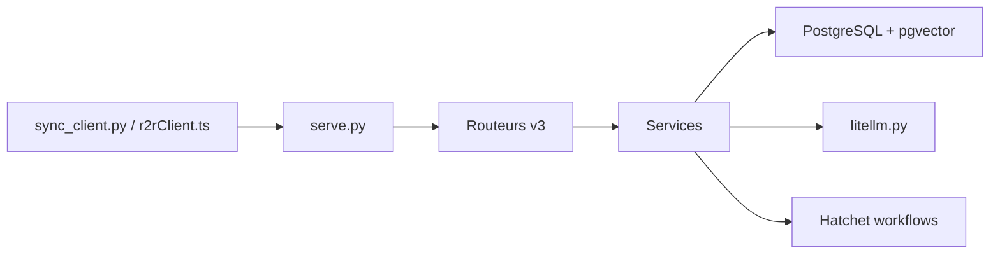

# SciPhi-AI/R2R

> Plateforme RAG auto-hébergeable exposée en API REST (fiche minimale : README racine vide).

## Le problème
README non exploitable : il ne contient que le lien `./py/README.md`. D'après l'architecture, R2R évite de monter soi-même ingestion, recherche hybride et agents RAG.

## Ce que ça fait vraiment
D'après le code : serveur Python (`serve.py`) avec routeurs v3 (documents, retrieval, graphs…).
Ingestion avec parseurs, découpage, embeddings, puis stockage dans PostgreSQL + pgvector.
Agents RAG et recherche, outils de recherche web, graphe de connaissances via workflows Hatchet.
SDK Python et TypeScript.

## Comment c'est branché

## Essayer
Aucune commande documentée dans le README racine.

## Coût et pièges
Clés LLM et embeddings à ta charge (OpenAI, LiteLLM…). Le mode complet exige Postgres, Hatchet, RabbitMQ et MinIO.

## Ce que ce n'est pas
Non documenté dans le README racine : la fiche repose uniquement sur l'architecture déduite du code.

## Alternatives
Aucune alternative nommée dans le README.

## Pour toi
À surveiller : l'architecture RAG est complète et pertinente pour toi, mais il faut lire `py/README.md` avant de juger, car le README racine ne dit rien.
