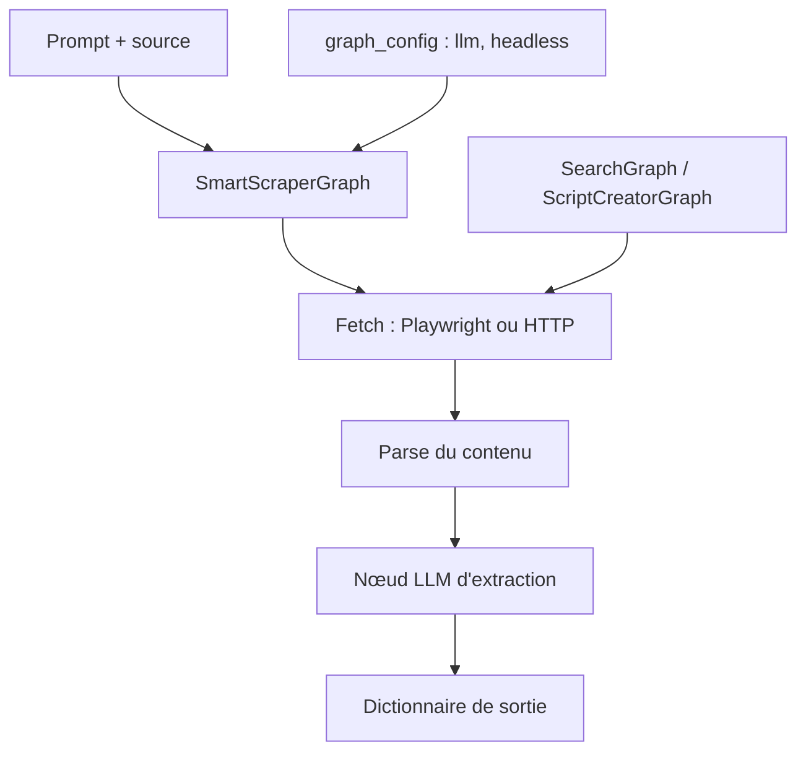

# ScrapeGraphAI/Scrapegraph-ai

> Bibliothèque Python qui construit des pipelines de scraping en graphe, pilotés par un LLM.

## Le problème
Un scraper écrit à la main casse dès que la page change de structure.
Décrire ce qu'on veut extraire est simple ; écrire les sélecteurs qui le font ne l'est pas.

## Ce que ça fait vraiment
On donne un prompt et une source (URL ou fichier XML, HTML, JSON, Markdown) ; la bibliothèque construit le pipeline d'extraction et retourne un dictionnaire.
Plusieurs pipelines standards : `SmartScraperGraph` (une page), `SearchGraph` (les n premiers résultats d'un moteur), `SpeechGraph` (extraction + fichier audio), `ScriptCreatorGraph` (génère un script Python), plus les variantes multi-pages qui parallélisent les appels LLM.
Fonctionne avec OpenAI, Groq, Azure, Gemini, MiniMax ou des modèles locaux via Ollama, en changeant uniquement le bloc `llm` de la configuration.
Intégrations : SDK Python et Node, LangChain, LlamaIndex, Crew.ai, Agno, CamelAI, Pipedream, Zapier, n8n, Dify, serveur MCP.

## Comment c'est branché


## Essayer
```bash
pip install scrapegraphai
playwright install
```

```python
from scrapegraphai.graphs import SmartScraperGraph
graph_config = {"llm": {"model": "ollama/llama3.2", "model_tokens": 8192, "format": "json"}, "verbose": True, "headless": False}
smart_scraper_graph = SmartScraperGraph(prompt="Extract useful information from the webpage", source="https://scrapegraphai.com/", config=graph_config)
print(smart_scraper_graph.run())
```

## Coût et pièges
MIT et gratuit côté bibliothèque ; les tokens LLM sont à votre charge, ou gratuits en local via Ollama.
Télémétrie d'usage anonyme activée par défaut : désactivable avec `SCRAPEGRAPHAI_TELEMETRY_ENABLED=false`.

## Ce que ce n'est pas
Ce n'est pas un service géré : proxies, anti-bot, rendu JavaScript et mise à l'échelle restent votre responsabilité dans la version open source.
Ce n'est pas déterministe : l'extraction passe par un LLM, donc variable d'un run à l'autre et coûteuse à l'échelle.
Les fonctions Crawl, Monitor et History n'existent que dans l'API managée payante.

## Alternatives
- scrapegraph-py / scrapegraph-js — les SDK de l'API managée du même éditeur, si vous ne voulez pas gérer l'infrastructure.

## Pour toi
Bon pour extraire ponctuellement du structuré de pages hétérogènes ; mesurer le coût en tokens avant tout traitement de masse.
