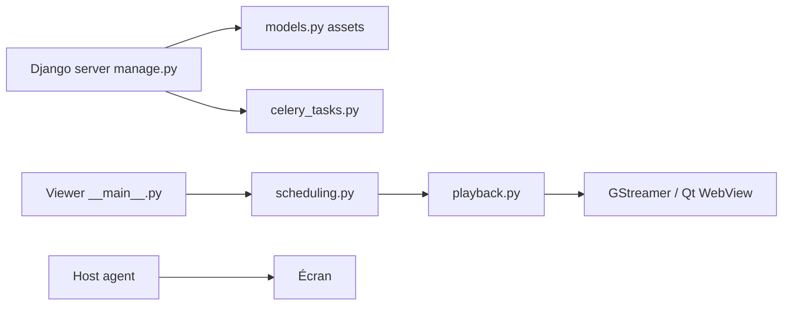

# Screenly/Anthias

> Logiciel d'affichage dynamique pour Raspberry Pi et PC, issu de Screenly OSE.

## Le problème
Piloter des écrans d'affichage (images, vidéos, pages web) demande un lecteur fiable et une interface de gestion simple.

## Ce que ça fait vraiment
Trois processus Python tournent sur l'appareil : un serveur Django (interface, API REST v2, planification, ASGI), un lecteur qui choisit les contenus et les rend via GStreamer ou un WebView Qt, et un agent hôte (écran, HDMI-CEC, stockage, sous-tension). Celery et Redis traitent les tâches différées. Déploiement en conteneurs, balena ou Ansible. Les cartes ARM 64 bits hors Raspberry Pi sont prises en charge au mieux.

## Comment c'est branché

## Essayer
La commande d'installation n'est pas dans le README (il renvoie à la page d'installation du site). Le dépôt fournit `docker-compose.yml.tmpl`, `balena.yml` et `ansible/site.yml`.

## Coût et pièges
Matériel dédié. Sur les cartes non Raspberry Pi, la vidéo est décodée en logiciel : saccadée en 1080p, inadaptée au 4K. Seul Armbian basé sur Debian fonctionne.

## Ce que ce n'est pas
Ce n'est pas le produit payant Screenly. Rien à voir avec les données ou l'IA. La licence est présente mais GitHub ne la reconnaît pas.

## Alternatives
Screenly, la version payante dont Anthias a été séparé.

## Pour toi
À ignorer : affichage dynamique sans lien avec l'IA ou le MLOps.
