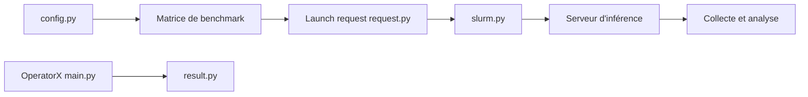

# SemiAnalysisAI/InferenceX

> Plateforme de benchmark continu des moteurs d'inférence LLM sur matériels GPU, avec tableau de bord public.

## Le problème
Les benchmarks d'inférence figés vieillissent vite, alors que les moteurs (vLLM, SGLang, TensorRT-LLM) progressent chaque semaine.

## Ce que ça fait vraiment
Le README fourni s'arrête après la section « Why? » : il décrit l'objectif (suivre en quasi temps réel les performances) et renvoie au tableau de bord inferencex.com. D'après le code, l'outillage lance des benchmarks de serving via un ordonnanceur de cluster (Slurm), collecte et analyse les résultats, avec des évaluations, CollectiveX (communications) et OperatorX (opérateurs par backend matériel).

## Comment c'est branché

## Essayer
Aucune commande documentée dans le README fourni (texte tronqué) ; le tableau de bord public est le point d'entrée indiqué.

## Coût et pièges
Reproduire les mesures exige des clusters de GPU. Le README précise que seul ce dépôt porte les résultats officiels ; les copies doivent être marquées non officielles. 278 issues ouvertes.

## Ce que ce n'est pas
Pas un outil pour servir des modèles : c'est un banc de mesure. Les mentions de confiance par de grandes entreprises sont des affirmations du README, non vérifiées.

## Alternatives
Aucune alternative nommée dans le README.

## Pour toi
À surveiller : utile pour choisir un moteur et un matériel d'inférence d'après des chiffres actualisés, même sans rejouer les benchmarks.

