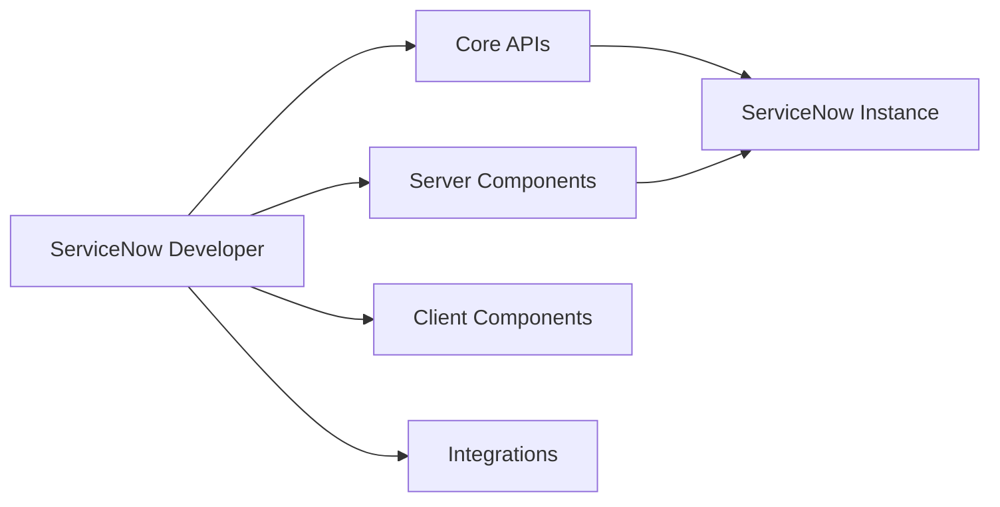

# ServiceNowDevProgram/code-snippets

> Collection communautaire d'extraits de code ServiceNow, classés en six catégories, pour développeurs de la plateforme.

## Le problème
Retrouver des exemples concrets de GlideRecord, de règles métier ou d'intégrations REST.

## Ce que ça fait vraiment
Dépôt de dossiers d'extraits (JavaScript) avec un README chacun, répartis en six catégories : API de base, composants serveur, composants client, développement moderne, intégrations, domaines spécialisés. Les extraits sont indépendants, sans exécution commune. Contributions guidées par CONTRIBUTING.md (Hacktoberfest).

## Comment c'est branché


## Essayer
```bash
# Aucune commande dans le README : parcourir les catégories, copier un extrait, l'adapter dans l'instance.
```

## Coût et pièges
Gratuit ; une instance ServiceNow est nécessaire pour utiliser le code. Licence : aucune déclarée. Dernier push le 2025-10-31.

## Ce que ce n'est pas
Pas importable directement dans ServiceNow, ni vérifié ou supporté officiellement : code communautaire à relire.

## Alternatives
Dépôt principal Hacktoberfest de ServiceNowDevProgram (mentionné sans nom précis).

## Pour toi
À ignorer : utile seulement aux développeurs ServiceNow, et sans licence claire.

