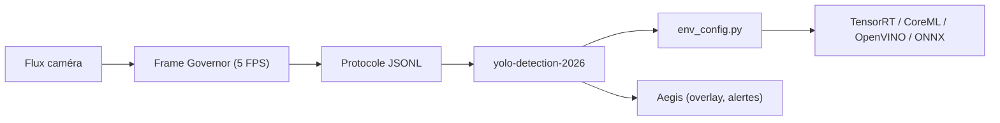

# SharpAI/DeepCamera

> Plateforme de « skills » de vision pour caméras (détection, segmentation, vie privée), pilotée par l'application Aegis.

## Le problème
Brancher des modèles de détection sur des flux caméra suppose d'adapter chaque modèle au matériel (NVIDIA, Apple, Intel, Coral).

## Ce que ça fait vraiment
Chaque skill est un module avec son `SKILL.md`, parlant en JSONL stdin/stdout avec Aegis. Le sélecteur `env_config.py` détecte le GPU et convertit YOLO26 vers TensorRT, CoreML, OpenVINO ou ONNX. Skills prêts : détection YOLO, Coral TPU, SAM2, estimation de profondeur (anonymisation), annotation, HomeSec-Bench (143 tests LLM/VLM). D'autres sont planifiés (reconnaissance de visages, plaques). Un agent LLM installe les skills. Le dépôt garde aussi des applications héritées (Node, embeddings faciaux, Celery).

## Comment c'est branché

## Essayer
Le README ne donne pas de commande pour les skills : l'installation passe par le bouton d'Aegis (application à télécharger). Pour les anciennes applications : `sharpai-cli deepcamera start`.

## Coût et pièges
Gratuit ; la version bureau Aegis est un téléchargement séparé dont les conditions ne sont pas décrites. Alertes envoyables vers Discord, Telegram, Slack. Une partie du catalogue est « planifiée » seulement. Chiffres du benchmark (72 %, 96 %, 98 %) sont ceux de l'auteur.

## Ce que ce n'est pas
Pas un logiciel de vidéosurveillance clé en main : plate-forme en construction, avec code hérité hétérogène.

## Alternatives
Non documenté dans le README.

## Pour toi
Surveiller : la conversion automatique vers le bon backend matériel et HomeSec-Bench sont instructifs ; le reste est encore de la planification.
