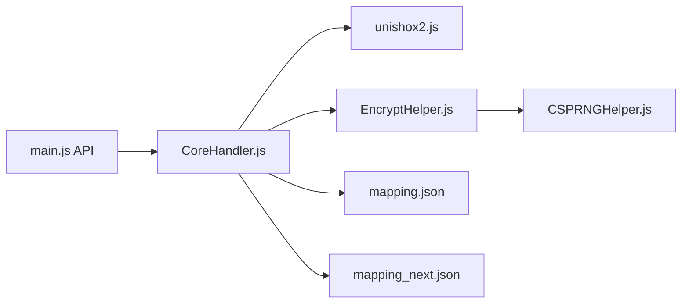

# SheepChef/Abracadabra

> Chiffrement de texte qui produit un texte chinois de style classique, en JavaScript, extension et Android.

## Le problème
Un chiffrement classique donne du texte illisible qui attire l'attention ; ici on veut un résultat qui ressemble à du chinois écrit.

## Ce que ça fait vraiment
Chaîne : compression (Unishox2 pour le court, GZIP au-delà), AES-256-CTR (avec suites avancées optionnelles : IV, HMAC-SHA256, PBKDF2, TOTP), Base64, trois rotors, puis mappage vers 3000 caractères chinois courants et mode « simulation » en phrases de chinois classique. Décode aussi les textes « 熊曰 ». Disponible comme page statique, extension navigateur et APK hors ligne.

## Comment c'est branché


## Essayer
```bash
# Aucune commande dans le README : voir le « projet principal » (page statique),
# les extensions de navigateur et l'APK en Release.
```

## Coût et pièges
Gratuit. Licence privée AIPL-1.1 : l'usage vaut acceptation des conditions, à lire avant intégration.

## Ce que ce n'est pas
Pas une garantie de secrecy par obscurité : la sécurité vient d'AES. Le texte chiffré est bien plus long que l'original.

## Alternatives
Aucune alternative nommée ; les projets de style 熊曰, 佛曰 et 兽音 sont mentionnés comme inspirations.

## Pour toi
À surveiller : curiosité de stéganographie linguistique, sans usage data/IA ; la licence personnalisée freine toute réutilisation.

