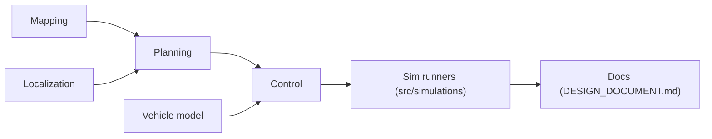

# ShisatoYano/AutonomousVehicleControlBeginnersGuide

> Collection de simulations Python des algorithmes de conduite autonome, pour apprendre localisation, planification et suivi de trajectoire.

## Le problème
Les algorithmes de véhicule autonome sont dispersés dans des articles ; les implémentations lisibles et testées sont rares.

## Ce que ça fait vraiment
Code Python pédagogique (NumPy, SciPy, Matplotlib) : localisation (filtres de Kalman étendu et unscented, filtre à particules), cartographie (grille d'occupation, NDT), planification (A*, Hybrid A*, D*, RRT*, PRM, PSO, Q-Learning), suivi de trajectoire (Pure Pursuit, Stanley, LQR, MPC, MPPI), perception. Chaque simulation est un script autonome avec tests pytest. L'auteur envisage un livre.

## Comment c'est branché


## Essayer
```bash
git clone https://github.com/ShisatoYano/AutonomousVehicleControlBeginnersGuide
. run_test_suites.sh
python src/simulations/localization/extended_kalman_filter_localization/extended_kalman_filter_localization.py
```

## Coût et pièges
Gratuit ; Python 3.13 attendu, Linux natif ou VM ; un Dev Container est fourni. Documentation « pas terminée » selon l'auteur.

## Ce que ce n'est pas
Pas une pile de conduite autonome utilisable sur un véhicule : c'est du matériel de cours.

## Alternatives
Aucune alternative nommée dans le README.

## Pour toi
À surveiller : bon support pour comprendre filtres de Kalman et planification, mais utile en apprentissage, pas en production.

