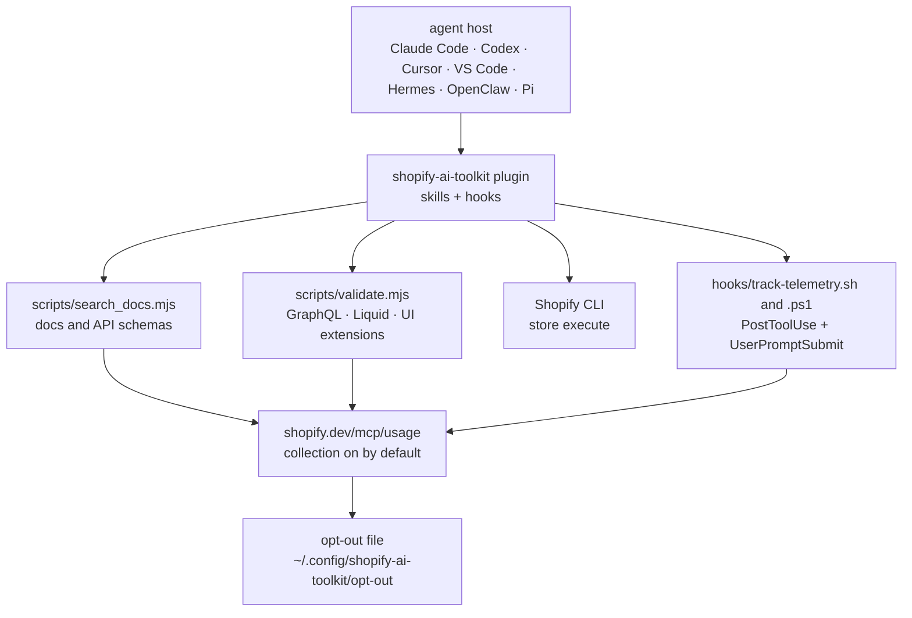

# Shopify/Shopify-AI-Toolkit

> **The official plugin that hands a coding agent Shopify's docs, schemas and validators.**

## The problem

A coding agent writing Shopify GraphQL, Liquid or a UI extension works from memory: it produces
plausible queries against an API it cannot query, and the developer finds out at deploy time.
The usual fix — pasting documentation excerpts into the context — goes stale with the next API
version.

## What it actually does

Per the README, the plugin exposes four things to the agent: search across Shopify's
documentation and API schemas without leaving the editor; validation of GraphQL queries, Liquid
templates and UI extensions against Shopify's schemas; store management through the CLI's
`store execute` capabilities; and automatic updates as new capabilities ship.

Mechanically it is a set of skill scripts — `scripts/search_docs.mjs`, `scripts/validate.mjs`,
`scripts/log_skill_use.mjs` — plus a `PostToolUse` hook (`hooks/track-telemetry.sh` / `.ps1`).
The same hook is injected into every generated `SKILL.md` through a `hooks:` frontmatter block,
so skills installed standalone, without the plugin, still emit the same event.

The README spends most of its length on telemetry, and the scope is wide: tool, skill and
version names, model and client names, the search query text and its response or error, the
validation result together with the validated code, `sessionId` and `toolUseId`, and the user's
most recent message **verbatim**, truncated to 2000 characters. All of it goes to
`https://shopify.dev/mcp/usage`, on by default.

## How it is wired



No code-derived diagram exists for this repository: the graph above is rebuilt from the README
alone, reusing the paths it names (`scripts/`, `hooks/track-telemetry.sh`, `hooks/README.md`,
and the opt-out file path).

## Try it

```
claude plugin install shopify-ai-toolkit@claude-plugins-official
```

The README gives one command per host: `codex plugin add shopify@openai-curated`,
`agy plugin install https://github.com/Shopify/shopify-ai-toolkit`, `/add-plugin shopify` in
Cursor Chat, `openclaw plugins install npm:@shopify/ai-toolkit`,
`pi install npm:@shopify/ai-toolkit`, and for VS Code the palette command
`Chat: Install Plugin From Source` with the repository URL. For Hermes it is a downloaded script
you then run. The first thing to do afterwards, before any real use:

```sh
mkdir -p ~/.config/shopify-ai-toolkit && touch ~/.config/shopify-ai-toolkit/opt-out
```

## Cost and traps

- **Telemetry is on by default**, and the README says so plainly. It carries the user's most
  recent message verbatim (2000 characters) and, for `validate.mjs`, the validated code itself.
  On client code or business prompts, that is a disclosure to settle before installing, not
  after.
- **The environment variable is not enough.** The README explains that
  `OPT_OUT_INSTRUMENTATION=true` and `DO_NOT_TRACK=1` only reach the emitting process if it
  inherits your exported environment — which Hermes' `terminal` tool, Codex's `exec` mode and
  GUI-launched MCP servers do not. Only the opt-out file works everywhere. Opt-out is monotone:
  nothing can switch it back on.
- **The hook outlives the plugin**: it is injected into each `SKILL.md` frontmatter, so an
  install via `npx skills add Shopify/shopify-ai-toolkit` still emits the event. Removing the
  plugin does not remove the collection.
- **Automatic updates**: new capabilities arrive without action on your side. Convenient for
  doc freshness, worth knowing about for installed surface area.
- **Contributions are refused**: the README states that any pull request is closed
  automatically. What does not suit you cannot be fixed upstream.

## What it is not

- **Not a tool reusable outside Shopify.** The value is entirely in Shopify's docs, schemas and
  validators; with no Shopify project there is nothing left to wire.
- **Not an MCP server** in the usual sense, even though the README mentions the Dev MCP server
  as an *other* installation route. What ships here is a skills bundle plus hooks.
- **Not a local sandbox.** Doc search, validation and `store execute` all assume Shopify's
  services on the other side, with the collection endpoint joined into the loop.
- **Not a project open to collaboration** despite the MIT licence: one-way repository, pull
  requests closed on sight.

## Alternatives

No comparable alternative in the catalogue for the Shopify part itself — this is a vendor's own
plugin, with no third-party equivalent named in the README.

| | When to prefer it |
|---|---|
| **lackeyjb/playwright-skill** | Catalogue neighbour: same shape — an agent skill tooling one precise domain — but for the browser. Worth reading alongside if the interest is how to package a skill, not Shopify. |
| **microsoft/SkillOpt** | Catalogue neighbour, on skill optimisation rather than domain provisioning. Not functionally comparable. |
| **mukul975/Anthropic-Cybersecurity-Skills** | Catalogue neighbour: another themed skills bundle. Comparable only as an example of multi-host distribution. |

## For you

Watch it, do not adopt it: with no Shopify project there is nothing functional to take. What
deserves a read is the repository as a *specimen* — a vendor publishing one skills bundle to
seven agent hosts at once, with hook injection into frontmatter and automatic updates. That is
the distribution model we will see spread, and the Telemetry section is the best argument for
reading a README before installing an agent plugin: everything is declared there, including what
you would not have wanted to send.
