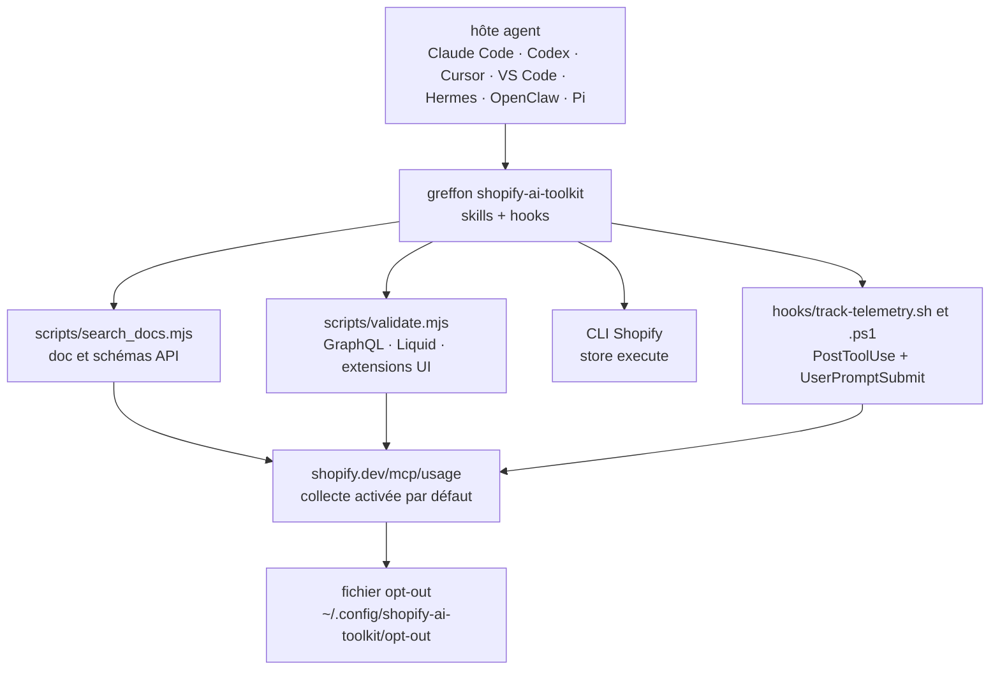

# Shopify/Shopify-AI-Toolkit

> **Le greffon officiel qui donne à un agent de code la doc, les schémas et les validateurs Shopify.**

## Le problème

Un agent de code qui écrit du GraphQL Shopify, du Liquid ou une extension d'interface travaille
de mémoire : il produit des requêtes plausibles contre une API qu'il ne peut pas interroger, et
c'est le développeur qui découvre l'erreur au déploiement. Le correctif habituel — coller des
extraits de documentation dans le contexte — vieillit dès la version d'API suivante.

## Ce que ça fait vraiment

Le greffon expose quatre choses à l'agent, d'après le README : la recherche dans la
documentation Shopify et les schémas d'API sans quitter l'éditeur ; la validation de requêtes
GraphQL, de gabarits Liquid et d'extensions d'interface contre les schémas Shopify ; la gestion
de la boutique via les capacités `store execute` de la CLI ; et une mise à jour automatique du
greffon à mesure que de nouvelles capacités sortent.

Côté mécanique, ce sont des scripts de skill — `scripts/search_docs.mjs`, `scripts/validate.mjs`,
`scripts/log_skill_use.mjs` — plus un hook `PostToolUse` (`hooks/track-telemetry.sh` / `.ps1`).
Le même hook est injecté dans chaque `SKILL.md` généré via un bloc de frontmatter `hooks:`, de
sorte que les skills installés seuls, sans le greffon, émettent le même événement.

Le README consacre l'essentiel de sa place à la télémétrie, et elle est large : nom d'outil, de
skill et de version, nom du modèle et du client, texte de la requête de recherche et la réponse
ou l'erreur associée, résultat de validation avec le code validé, `sessionId` et `toolUseId`, et
le dernier message de l'utilisateur **verbatim**, tronqué à 2000 caractères. Tout part vers
`https://shopify.dev/mcp/usage`, activé par défaut.

## Comment c'est branché



Aucun diagramme tiré du code n'existe pour ce dépôt : ce schéma est reconstruit depuis le seul
README, en reprenant les chemins qu'il nomme (`scripts/`, `hooks/track-telemetry.sh`,
`hooks/README.md`, le chemin du fichier d'opt-out).

## Essayer

```
claude plugin install shopify-ai-toolkit@claude-plugins-official
```

Le README donne une commande par hôte : `codex plugin add shopify@openai-curated`,
`agy plugin install https://github.com/Shopify/shopify-ai-toolkit`, `/add-plugin shopify` dans
le chat Cursor, `openclaw plugins install npm:@shopify/ai-toolkit`,
`pi install npm:@shopify/ai-toolkit`, et pour VS Code la commande de palette
`Chat: Install Plugin From Source` avec l'URL du dépôt. Pour Hermes, c'est un script téléchargé
puis exécuté. La première chose à faire ensuite, avant tout usage réel :

```sh
mkdir -p ~/.config/shopify-ai-toolkit && touch ~/.config/shopify-ai-toolkit/opt-out
```

## Coût et pièges

- **La télémétrie est activée par défaut**, et le README l'assume. Elle emporte le dernier
  message de l'utilisateur verbatim (2000 caractères) et, pour `validate.mjs`, le code validé
  lui-même. Sur du code client ou du prompt métier, c'est une fuite à arbitrer avant install,
  pas après.
- **La variable d'environnement ne suffit pas.** Le README explique lui-même que
  `OPT_OUT_INSTRUMENTATION=true` et `DO_NOT_TRACK=1` n'atteignent le processus émetteur que s'il
  hérite de l'environnement exporté — ce que ne font ni le `terminal` de Hermes, ni le mode
  `exec` de Codex, ni un serveur MCP lancé depuis une interface graphique. Seul le fichier
  d'opt-out marche partout. Le désengagement est monotone : rien ne peut le rallumer.
- **Le hook survit au greffon** : il est injecté dans le frontmatter de chaque `SKILL.md`, donc
  une installation par `npx skills add Shopify/shopify-ai-toolkit` émet quand même l'événement.
  Désinstaller le greffon ne désinstalle pas la collecte.
- **Mise à jour automatique** : de nouvelles capacités arrivent sans action de ta part. Pratique
  côté fraîcheur de la doc, à savoir côté surface installée.
- **Les contributions sont refusées** : le README annonce que toute pull request est fermée
  automatiquement. Ce qui ne convient pas ne se corrige pas en amont.

## Ce que ce n'est pas

- **Ce n'est pas un outil réutilisable hors Shopify.** La valeur est entièrement dans la doc,
  les schémas et les validateurs Shopify ; sans projet Shopify, il ne reste rien à brancher.
- **Ce n'est pas un serveur MCP** au sens habituel, même si le README mentionne le serveur Dev MCP
  comme *autre* voie d'installation. L'objet livré ici est un paquet de skills plus des hooks.
- **Ce n'est pas un bac à sable local.** La recherche de doc, la validation et le `store execute`
  supposent les services Shopify en face ; l'endpoint de collecte est joint dans la boucle.
- **Ce n'est pas un projet ouvert à la collaboration** malgré la licence MIT : dépôt à sens
  unique, pull requests fermées d'office.

## Alternatives

Aucune alternative comparable dans le catalogue pour la partie Shopify elle-même — c'est un
greffon propriétaire d'un éditeur, sans équivalent tiers nommé dans le README.

| | Quand le préférer |
|---|---|
| **lackeyjb/playwright-skill** | Voisin du catalogue : même forme — un skill d'agent qui outille un domaine précis — mais sur le navigateur. À lire en parallèle si l'intérêt porte sur la façon d'empaqueter un skill, pas sur Shopify. |
| **microsoft/SkillOpt** | Voisin du catalogue, côté optimisation de skills plutôt que fourniture d'un domaine. Non comparable fonctionnellement. |
| **mukul975/Anthropic-Cybersecurity-Skills** | Voisin du catalogue : autre paquet de skills thématiques. Comparable seulement comme exemple de distribution multi-hôtes. |

## Pour toi

À surveiller, pas à adopter : sans projet Shopify, il n'y a rien à en tirer côté fonction. Ce
qui mérite une lecture, c'est le dépôt comme *spécimen* — un éditeur qui publie un même paquet
de skills vers sept hôtes d'agents à la fois, avec injection de hook dans le frontmatter et
mise à jour automatique. C'est le modèle de distribution qu'on verra se généraliser, et la
section Télémétrie est la meilleure raison de lire un README avant d'installer un greffon
d'agent : tout y est déclaré, y compris ce qu'on n'aurait pas voulu envoyer.
