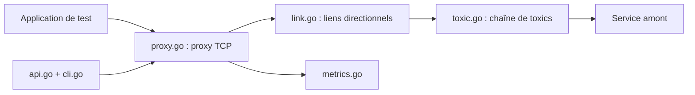

# Shopify/toxiproxy

> Proxy TCP qui simule des pannes réseau pour tester la résilience d'une application en CI et en dev.

## Le problème
Prouver qu'une application survit à une base ou un cache lent ou en panne demande de dégrader le réseau de façon reproductible, sans droits root.

## Ce que ça fait vraiment
Un serveur Go écoute sur des ports, relaie vers l'amont, et applique des « toxics » pilotés par API HTTP (port 8474) : latence, panne, bande passante, fermeture lente, timeout, reset, découpage de paquets, perte de paquets. Des clients existent en plusieurs langages ; une CLI et des métriques Prometheus sont fournies.

## Comment c'est branché


## Essayer
```bash
docker pull ghcr.io/shopify/toxiproxy
docker run --rm -it ghcr.io/shopify/toxiproxy
toxiproxy-cli create -l localhost:26379 -u localhost:6379 redis
toxiproxy-cli toxic add -t latency -a latency=1000 redis
```

## Coût et pièges
Gratuit. Utiliser des ports hors de la plage éphémère Linux. MySQL peut passer par un socket Unix et ignorer le proxy.

## Ce que ce n'est pas
Ne simule que du TCP, pas de pannes machine ou disque. Il faut configurer l'application pour passer par le proxy.

## Alternatives
- Aucune alternative nommée dans le README (il cite `nc` et des outils Linux, non retenus pour la portabilité).

## Pour toi
À adopter : pour tester qu'un service d'inférence ou un pipeline gère une base ou un feature store lent ou coupé, c'est simple et sans root.

