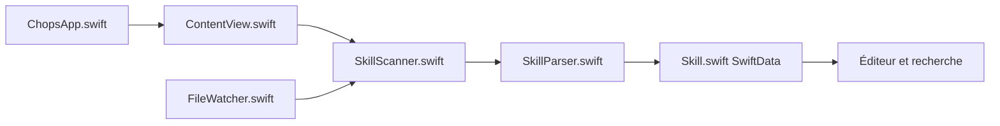

# Shpigford/chops

> Application macOS pour découvrir, organiser et éditer les skills et agents de plusieurs outils de codage.

## Le problème
Les skills et agents sont dispersés dans les dossiers cachés de chaque outil (Claude Code, Cursor, Codex, Windsurf, Amp), difficiles à retrouver.

## Ce que ça fait vraiment
SwiftUI et SwiftData, sans vue web. `SkillScanner` parcourt les répertoires de chaque outil, `SkillParser` lit le frontmatter YAML ou les fichiers `.mdc` de Cursor, `FileWatcher` (FSEvents) relance l'analyse à chaque changement. Recherche plein texte, collections sans modifier les sources, éditeur intégré, création de skills, serveurs distants, registre skills.sh. Les doublons via liens symboliques ne comptent qu'une fois.

## Comment c'est branché


## Essayer
```bash
git clone https://github.com/Shpigford/chops.git
cd chops
brew install xcodegen
xcodegen generate
open Chops.xcodeproj
```

## Coût et pièges
macOS 15+, Xcode et xcodegen. L'application désactive le bac à sable volontairement pour lire les fichiers de configuration dans `~/`. Aucun test automatisé. Un binaire est proposé en téléchargement.

## Ce que ce n'est pas
Pas multiplateforme : macOS seulement. Pas un gestionnaire d'installation complet de skills. L'assistant de composition d'agents et la revue de diff n'ont pas été examinés dans le README.

## Alternatives
Aucune alternative nommée dans le README.

## Pour toi
À surveiller : utile si tu accumules des skills pour plusieurs agents sur Mac, mais l'absence de sandbox et la licence non reconnue demandent de la vigilance.

