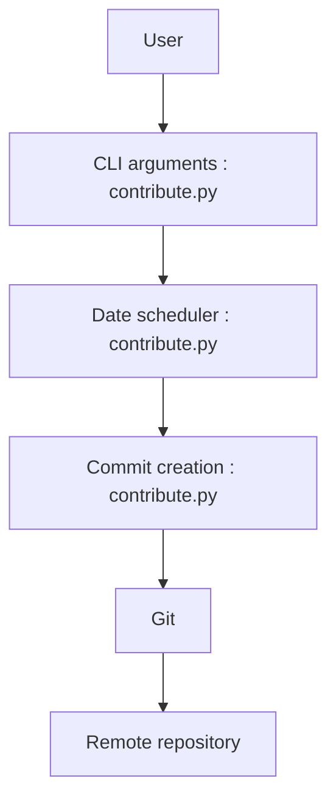

# Shpota/github-activity-generator

> Script Python qui fabrique des commits datés pour remplir artificiellement le graphe de contributions GitHub.

## Le problème
Obtenir un graphe d'activité GitHub rempli sans avoir réellement codé.

## Ce que ça fait vraiment
`contribute.py` initialise un dépôt git vide, modifie un fichier texte pour chaque jour de l'année écoulée (0 à 20 commits par jour), puis le pousse vers un dépôt distant si l'on donne `--repository`. Options : fréquence, maximum par jour, week-ends, plage de dates.

## Comment c'est branché


## Essayer
```bash
python contribute.py --repository=git@github.com:user/repo.git
python contribute.py --max_commits=12 --frequency=60 --repository=git@github.com:user/repo.git
python contribute.py --no_weekends
```

## Coût et pièges
Gratuit. Python et Git requis. Le README met en garde : ne pas s'en servir pour tromper sur son activité professionnelle.

## Ce que ce n'est pas
Pas un outil de productivité : il ne produit aucun travail réel, seulement un graphe truqué. Dernier push en janvier 2025.

## Alternatives
Aucune alternative nommée dans le README.

## Pour toi
À ignorer : fausser ton graphe de contributions nuit à ta crédibilité, et l'outil n'apporte rien d'utile.

