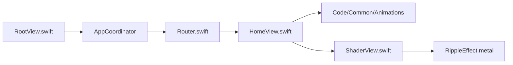

# Shubham0812/SwiftUI-Animations

> Collection d'une vingtaine d'animations SwiftUI et de shaders Metal à copier, pour développeurs iOS.

## Le problème
Écrire des animations d'interface soignées (loaders, boutons, bascules) en SwiftUI prend du temps sans exemples complets.

## Ce que ça fait vraiment
Une app de démonstration iOS 17+ liste 25+ animations, chacune dans son dossier autonome (`Code/Common/Animations/`). Deux shaders Metal (Burn, Ripple) sont fournis avec leur wrapper SwiftUI. Le retour haptique passe par `HapticManager`.

## Comment c'est branché


## Essayer
```bash
git clone https://github.com/Shubham0812/SwiftUI-Animations.git
cd SwiftUI-Animations
open SwiftUI-Animations.xcodeproj
```
Puis choisir un simulateur et lancer (⌘R).

## Coût et pièges
Gratuit, mais Xcode 16+ et iOS 17+ sont requis, donc un Mac.

## Ce que ce n'est pas
Pas une bibliothèque installable par gestionnaire de paquets : on copie les dossiers. Aucune couverture de tests documentée.

## Alternatives
Aucune alternative nommée dans le README.

## Pour toi
À ignorer pour un profil data/IA/MLOps : c'est du front iOS, sans lien avec tes chaînes de données ou de modèles.

