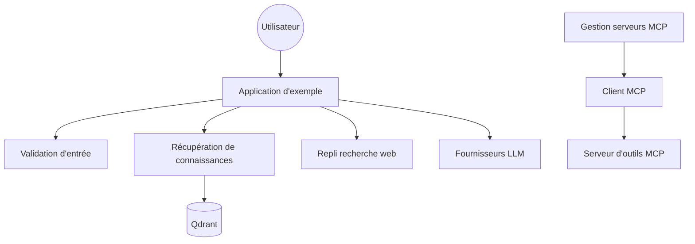

# Shubhamsaboo/awesome-llm-apps

> Catalogue de plus de cent agents et applications RAG en code exécutable, sous Apache-2.0.

## Le problème
Passer d'un tutoriel LLM à une application qui tourne demande de recoller des morceaux hétérogènes.
Les listes « awesome » habituelles renvoient vers des liens, pas vers du code que l'on peut lancer.

## Ce que ça fait vraiment
Range des applications complètes par catégorie : agents débutants, agents avancés, équipes multi-agents,
agents vocaux, agents MCP, RAG, mémoire, fine-tuning, optimisation de tokens, agents toujours actifs.
Chaque entrée est un dossier autonome avec ses dépendances et, le plus souvent, une interface Streamlit.
Inclut aussi des « agent skills » installables en une commande pour un agent de code.

## Comment c'est branché


## Essayer
```bash
git clone https://github.com/Shubhamsaboo/awesome-llm-apps.git
cd awesome-llm-apps/starter_ai_agents/ai_travel_agent
pip install -r requirements.txt
streamlit run travel_agent.py
```

## Coût et pièges
Apache-2.0, gratuit. Presque chaque exemple exige une clé d'API payante (OpenAI, Gemini, Firecrawl…).
Les modèles cités dans les descriptions changent vite ; les versions épinglées vieillissent.

## Ce que ce n'est pas
Pas une bibliothèque : rien à importer, ce sont des démonstrations à copier et adapter.
Pas du code de production — pas de tests, pas de gestion d'erreur sérieuse, pas de sécurité.
La qualité varie d'un dossier à l'autre : c'est un catalogue, pas un produit cohérent.

## Alternatives
- `addyosmani/agent-skills` : des workflows outillés plutôt que des démonstrations.
- `langchain-ai/langchain` : si l'on veut construire plutôt que recopier.

## Pour toi
Bon réservoir d'idées et de points de départ ; rien à reprendre tel quel dans un projet sérieux.
