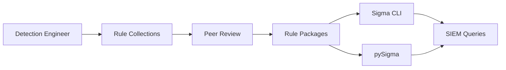

# SigmaHQ/sigma

> Dépôt de plus de 3000 règles de détection Sigma, format générique pour SIEM.

## Le problème
Les analystes écrivent leurs requêtes de détection dans le langage de leur SIEM, sans format commun pour les partager.

## Ce que ça fait vraiment
Fournit des règles YAML revues par des pairs : génériques, chasse (hunting), menaces émergentes, conformité, placeholders.
Les règles sont indépendantes du fournisseur et converties en requêtes SIEM par Sigma CLI, sigconverter.io, Detection Studio ou pySigma.
Paquets de règles publiés en releases. Aucun code d'implémentation dans ce dépôt.

## Comment c'est branché

## Essayer
Aucune commande documentée dans le README (télécharger les paquets depuis la page des releases).

## Coût et pièges
Gratuit. Licence non identifiée par GitHub : à vérifier avant usage commercial. Conversion via outils séparés.

## Ce que ce n'est pas
Pas un moteur de détection ni un convertisseur : juste les règles. Pas un SIEM.

## Alternatives
- pySigma : pour intégrer la conversion dans ta propre chaîne.
- Sigma CLI : convertisseur officiel en ligne de commande.

## Pour toi
À ignorer : ressource de référence en détection sécurité, sans lien avec la data science ou le MLOps sauf si tu entraînes des modèles sur des logs SOC.
