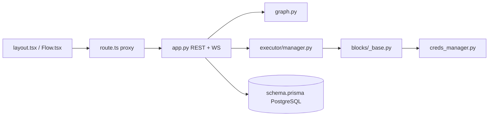

# Significant-Gravitas/AutoGPT

> Plateforme d'agents IA en graphe de blocs, hébergée payante ou auto-hébergée, pour automatiser des workflows.

## Le problème
Enchaîner appels LLM, intégrations SaaS, planification et déclencheurs demande d'écrire et d'opérer soi-même tout un runtime d'agents.

## Ce que ça fait vraiment
Un éditeur visuel Next.js (`Flow.tsx`) enregistre un agent comme un graphe versionné de blocs typés (`graph.py`). Un exécuteur asynchrone distinct de l'API (`executor/manager.py`, `scheduler.py`) lance les runs à la demande, sur planning ou sur webhook, en suivant état et coût.
Les blocs couvrent appels LLM, flux de contrôle, API externes et agents imbriqués ; les identifiants OAuth passent par `creds_manager.py`. Un Copilot conversationnel peut créer et lancer des agents, avec une mémoire Graphiti sur FalkorDB.
Infra : PostgreSQL/Supabase, Redis, RabbitMQ. L'ancien agent autonome reste dans `classic/` (MIT).

## Comment c'est branché

## Essayer
Aucune commande dans le README : l'installeur mono-conteneur est « à venir », il renvoie au guide d'auto-hébergement manuel.

## Coût et pièges
Plateforme hébergée payante (abonnement + usage par run). Auto-hébergement sans licence payante, mais Docker, infrastructure et clés d'API modèles à ta charge.

## Ce que ce n'est pas
Ce n'est plus l'« AutoGPT » autonome de 2023, désormais relégué dans `classic/`. L'auto-hébergement n'a pas encore d'installeur public, et c'est une pile lourde (Postgres, Redis, RabbitMQ, FalkorDB).

## Alternatives
- AutoGPT Classic (`classic/`, Forge, `agbenchmark`) — pour un agent autonome seul, ou pour mesurer un agent.

## Pour toi
À surveiller : intéressant pour orchestrer, mais l'auto-hébergement reste manuel et lourd.
