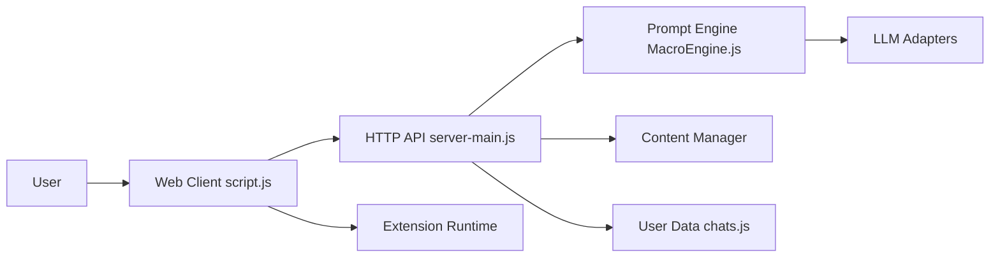

# SillyTavern/SillyTavern

> Interface web locale pour discuter avec plusieurs LLM, destinée aux utilisateurs avancés.

## Le problème
Non documenté dans le README (une ligne : « LLM Frontend for Power Users »).

## Ce que ça fait vraiment
D'après l'architecture décrite : client navigateur (`script.js`) servi par un serveur HTTP Node (`server.js`, `server-main.js`) qui relaie vers des fournisseurs LLM, image, synthèse vocale et embeddings.
Moteur de macros de prompt, cartes de personnages, lorebooks, extensions (mémoire, TTS).
Embeddings locaux ou vLLM pour la recherche vectorielle.

## Comment c'est branché

## Essayer
Aucune commande documentée dans le README.

## Coût et pièges
Clés des fournisseurs LLM à ta charge (déduit de l'architecture). AGPL-3.0.

## Ce que ce n'est pas
Pas un outil de développement ni de MLOps : orienté conversation et jeu de rôle. README insuffisant pour juger du reste.

## Alternatives
Aucune alternative nommée dans le README.

## Pour toi
Une interface de discussion grand public pour LLM, pensée pour le jeu de rôle, pas pour un usage pro data ou MLOps. À ignorer.
