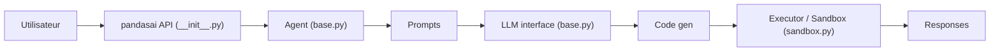

# Sinaptik-AI/pandas-ai

> Bibliothèque Python qui traduit des questions en langage naturel en code exécuté sur des dataframes.

## Le problème
Interroger un jeu de données demande d'écrire du pandas ou du SQL. Les profils non techniques en sont exclus, les autres y perdent du temps sur des requêtes routinières.

## Ce que ça fait vraiment
`df.chat("…")` envoie le schéma et la question à un LLM (via `pandasai-litellm`), qui génère du code ou du SQL.
Le sous-système `core/code_generation` nettoie et valide ce code avant exécution, en local ou dans un sandbox Docker (`pandasai-docker`).
Le résultat est typé : dataframe, nombre, texte, graphique ou erreur. Plusieurs dataframes peuvent être interrogés ensemble.
Des extensions séparées ajoutent connecteurs SQL, BigQuery, Snowflake, bases vectorielles ; une partie `ee` est sous licence entreprise.

## Comment c'est branché


## Essayer
```bash
pip install pandasai
pip install pandasai-litellm
pip install "pandasai-docker"
```

## Coût et pièges
Chaque question consomme des tokens chez ton fournisseur LLM (clé OpenAI dans les exemples). Python limité à 3.8–3.11 ; le sandbox Docker est optionnel mais recommandé.

## Ce que ce n'est pas
Pas un outil sans risque : sans sandbox, du code généré par un LLM tourne sur ta machine. Pas entièrement open source : le dossier `ee` relève d'une offre entreprise. Le module helpers inclut de la télémétrie (architecture).

## Alternatives
Aucune alternative nommée dans le README.

## Pour toi
À surveiller : utile pour prototyper de l'analyse conversationnelle, mais licence non identifiée et part entreprise à clarifier avant tout usage client.
