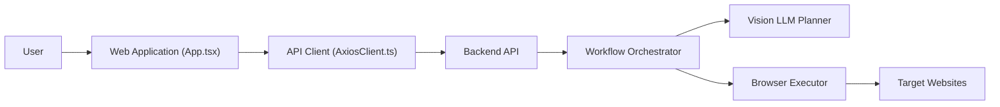

# Skyvern-AI/skyvern

> Automatisation de navigateur pilotée par LLM et vision, extension Playwright plus éditeur de workflows.

## Le problème
Les scripts d'automatisation web reposent sur des XPath qui cassent au moindre changement de mise en page, et chaque site demande son propre script.

## Ce que ça fait vraiment
Ajoute à la page Playwright `act`, `extract` (avec schéma JSON), `validate`, `prompt`, et un mode repli : sélecteur CSS d'abord, IA ensuite.
`page.agent.run_task` enchaîne des tâches multi-étapes ; les workflows combinent navigation, extraction, boucles, emails, blocs HTTP et code.
Serveur + UI locaux (SQLite par défaut, Postgres possible), livestream du navigateur, intégration Bitwarden, MCP, Zapier/Make/N8N.
Peut piloter ton propre Chrome via CDP.

## Comment c'est branché


## Essayer
```bash
pip install "skyvern[all]"
skyvern quickstart
skyvern run all
docker compose up -d
```

## Coût et pièges
Clé LLM à fournir dans `.env` ; chaque action consomme des appels vision. Skyvern Cloud est payant, avec anti-bot et CAPTCHA que la version locale n'a pas.

## Ce que ce n'est pas
Pas déterministe comme un script Playwright pur. AGPL-3.0. Télémétrie activée par défaut (désactivable via `SKYVERN_TELEMETRY=false`).

## Alternatives
Aucune alternative nommée dans le README.

## Pour toi
À surveiller : pratique pour de la collecte de données sur des sites sans API, mais le coût LLM par page et l'AGPL limitent l'usage à grande échelle ou en produit.
