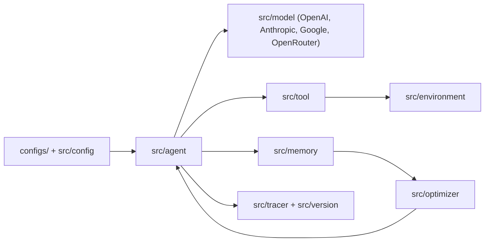

# SkyworkAI/DeepResearchAgent

> Runtime Python pour agents LLM dont prompts, outils et mémoire évoluent, destiné aux chercheurs en agents.

## Le problème
Les protocoles d'agents gèrent mal le cycle de vie, le versionnage et la mise à jour sûre de leurs composants. On retombe sur du code de colle fragile.

## Ce que ça fait vraiment
Prompts, agents, outils, environnements et mémoire sont des ressources versionnées, assemblées par des configs de type MMEngine. Une boucle Agir → Observer → Optimiser → Mémoriser s'appuie sur des optimiseurs (reflection, GRPO, Reinforce++). Le dépôt embarque aussi des agents de navigation, de trading et d'ESG, plus un LightRAG vendorisé.

## Comment c'est branché


## Essayer
```bash
python examples/run_tool_calling_agent.py --config configs/tool_calling_agent.py
python examples/run_tool_calling_agent.py \
  --config configs/tool_calling_agent.py \
  --cfg-options model_name=openrouter/gpt-4o workdir=workdir/demo tag=demo
```
Prérequis du README : installer les dépendances, copier `.env.template` en `.env` et y mettre une clé (ex. `OPENROUTER_API_KEY`).

## Coût et pièges
Clé d'API de modèle à ta charge. Le dépôt est très large (trading, ESG, LightRAG vendorisé) : la surface à comprendre est grande.

## Ce que ce n'est pas
Pas un produit « deep research » prêt à l'emploi : c'est un cadre d'expérimentation. Les modules de trading ou de mobile n'ont pas de garantie documentée. Le README ne donne pas de benchmarks.

## Alternatives
Aucune alternative nommée dans le README.

## Pour toi
À surveiller si tu étudies l'auto-amélioration d'agents (optimiseurs, traces, versionnage) : l'idée est solide, mais la maturité n'est pas documentée.

