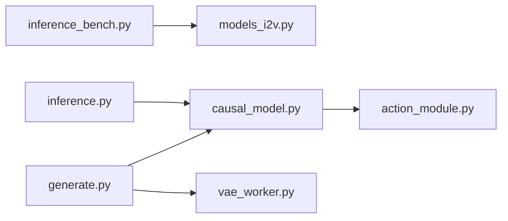

# SkyworkAI/Matrix-Game

> Famille de modèles de monde interactifs de Skywork AI qui génèrent de la vidéo pilotée par des commandes.

## Le problème
Non documenté dans le README, trop court pour l'établir.

## Ce que ça fait vraiment
Le README annonce trois générations (1.0, 2.0, 3.0) d'implémentations officielles de modèles de monde. D'après l'architecture : Matrix-Game 1 fait de l'image vers vidéo avec transformeur de diffusion ; la 2 ajoute génération causale et flux, avec conditionnement d'actions ; la 3 un décodage VAE asynchrone et du parallélisme de séquence ; une évaluation WorldScore est incluse.

## Comment c'est branché


## Essayer
```bash
# Aucune commande documentée dans le README.
```

## Coût et pièges
Non documenté ; modèles de diffusion vidéo, donc GPU attendu, ce qui n'est pas précisé dans le README.

## Ce que ce n'est pas
Pas documenté : il n'y a ni installation ni exemple dans le README, impossible de savoir comment l'utiliser.

## Alternatives
Aucune alternative nommée dans le README.

## Pour toi
À surveiller : sujet de recherche actif (modèles de monde), mais matière insuffisante pour trancher : lire les sous-dossiers avant d'investir du temps.

