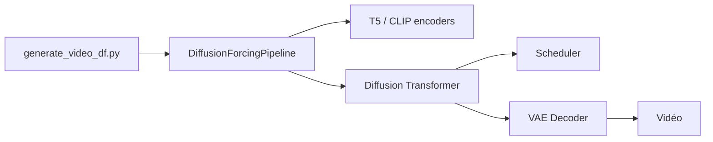

# SkyworkAI/SkyReels-V2

> Modèles de génération vidéo de longueur illimitée par Diffusion Forcing, avec code d'inférence.

## Le problème
Les modèles vidéo ouverts produisent surtout des clips de 5 à 10 secondes.

## Ce que ça fait vraiment
Poids 1,3B et 14B (540P/720P) en texte-vers-vidéo, image-vers-vidéo et Diffusion Forcing (extension de vidéo, contrôle début/fin). Inférence mono ou multi-GPU (xDiT USP), intégration `diffusers`, amélioreur de prompt Qwen2.5-32B, légendeur SkyCaptioner-V1. Les scores comparatifs sont ceux des auteurs.

## Comment c'est branché


## Essayer
```bash
git clone https://github.com/SkyworkAI/SkyReels-V2
cd SkyReels-V2
pip install -r requirements.txt
python3 generate_video_df.py --model_id Skywork/SkyReels-V2-DF-14B-540P --resolution 540P --ar_step 0 --base_num_frames 97 --num_frames 257 --overlap_history 17 --prompt "..." --addnoise_condition 20 --offload
```

## Coût et pièges
GPU : environ 14,7 Go de VRAM pour le 1,3B, 51 Go pour le 14B en 540P ; 64 Go+ avec l'amélioreur de prompt. Licence non identifiée par GitHub. Checkpoints 5B « bientôt ».

## Ce que ce n'est pas
Pas un produit clé en main : génération lente, surtout en mode asynchrone.

## Alternatives
Wan2.1-14B et HunyuanVideo-13B, comparés dans le README.

## Pour toi
Surveiller : intéressant pour la vidéo générative si tu as un GPU costaud ; licence à vérifier.

