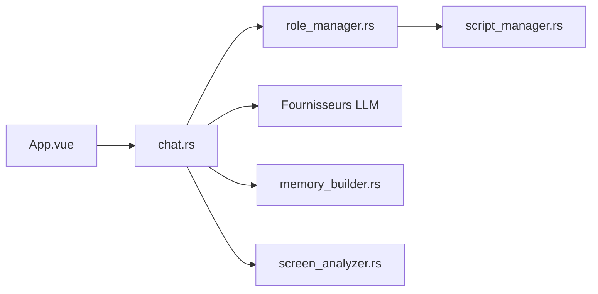

# SlimeBoyOwO/LingChat

> Compagnon de bureau à base d'IA, avec personnages, voix et mémoire, pour les amateurs de jeux narratifs.

## Le problème
Les assistants de conversation sont impersonnels ; ici on veut un personnage persistant avec émotions, mémoire et présence sur le bureau.

## Ce que ça fait vraiment
Application de bureau Windows de chat avec personnages personnalisables, mémoire par sauvegarde, reconnaissance d'émotions, voix via VITS, vision d'écran (surveillance proactive), mode animal de bureau, scripts multi-personnages, pomodoro, agenda et tâches. Le modèle de langage s'ajoute par clé d'API (DeepSeek ou autre) dans les paramètres.

## Comment c'est branché

## Essayer
Aucune commande documentée : télécharger l'archive `LingChat vX.X.X.7z` depuis les Releases, lancer `LingChat.exe`, puis saisir la clé d'API dans les paramètres avancés.

## Coût et pièges
Clé d'API à ta charge (crédit requis sur la plateforme choisie). La vision demande un modèle visuel. Windows peut supprimer l'exécutable par erreur (Defender). Voix lente sur GPU intégré.

## Ce que ce n'est pas
Pas un outil de productivité sérieux : une application de divertissement. Les ressources (Blue Archive, Undertale) et le dessin par défaut sont à ne pas utiliser commercialement. Licence AGPL-3.0. README en chinois.

## Alternatives
Aucune alternative nommée dans le README (Zcchat est cité comme source d'inspiration).

## Pour toi
Ignorer : application grand public sans rapport avec data/IA/MLOps, avec des ressources à usage non commercial.

