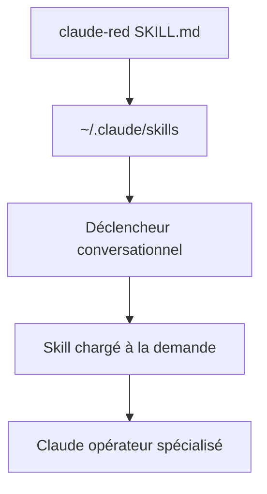

# SnailSploit/Claude-Red

> Bibliothèque de skills de sécurité offensive pour Claude, sous forme de fichiers SKILL.md.

## Le problème
Faire de Claude un opérateur red team contextuel demande de lui injecter à chaque fois la méthodologie experte d'une surface d'attaque. Rien de réutilisable et chargé à la demande.

## Ce que ça fait vraiment
Bibliothèque curée de skills offensifs pour le système de Skills de Claude. Chaque `SKILL.md` amorce Claude avec la méthodologie d'une surface d'attaque (SQLi, XSS, SSRF, exploit dev, EDR evasion, ADCS, wireless, cloud, K8s, C2…). Chargement à la demande selon des déclencheurs conversationnels : pas de coût contexte pour les skills non utilisés. ~90 skills en 23 catégories. Cas d'usage : engagements red team autorisés, bug bounty, recherche, CTF, entraînement.

## Comment c'est branché


## Essayer
```bash
git clone https://github.com/SnailSploit/claude-red ~/.claude/skills/claude-red
```
```bash
./install.sh --category web
```

## Coût et pièges
Gratuit, rien à installer côté runtime. Contenu offensif : réservé aux engagements autorisés, CTF, recherche. Mainteneur unique. Efficacité dépend du modèle et de la qualité des SKILL.md.

## Ce que ce n'est pas
Pas des outils exécutables : des fichiers de méthodologie qui priment le comportement de Claude. Pas destiné à un usage non autorisé.

## Alternatives
Non nommées dans le README.

## Pour toi
Intéressant si tu fais du pentest/CTF autorisé avec Claude ; sinon hors de ton axe data/IA — surveiller comme curiosité skills.
