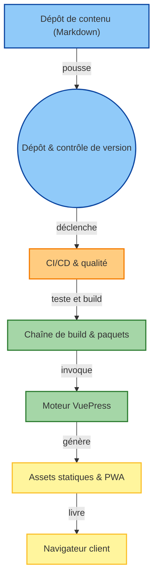

# Snailclimb/JavaGuide

> Recueil chinois de fiches de révision pour entretiens de développeur backend Java.

## Le problème
Préparer un entretien backend suppose de rassembler Java, JVM, réseau, SQL, Redis et systèmes distribués.
Les ressources sont éparpillées et de qualité inégale.

## Ce que ça fait vraiment
Agrège des centaines de fiches Markdown : bases Java, collections, concurrence, JVM, nouveautés par version.
Couvre aussi OS, réseau, structures de données, MySQL, Redis, MongoDB, Spring, sécurité, distribué.
Publié comme site statique VuePress, lisible en ligne sur javaguide.cn.
Renvoie vers des contenus payants de l'auteur (guide d'entretien, questions de design système).

## Comment c'est branché

## Essayer
Aucune commande d'installation documentée : la lecture se fait sur javaguide.cn ou dans `docs/`.

## Coût et pièges
Le dépôt est gratuit ; plusieurs ressources liées sont payantes. Contenu quasi exclusivement en chinois.
Aucune licence déclarée dans le README, qui interdit explicitement la reprise sans attribution.

## Ce que ce n'est pas
Pas un cours : une liste de fiches de révision, orientée réussite d'entretien plutôt que pratique.
Pas de contenu data, ML ou MLOps ; la section IA renvoie à un autre dépôt du même auteur.
Pas de code exécutable — c'est de la documentation.

## Alternatives
- `shareAI-lab/learn-claude-code` : même format pédagogique, sur un sujet agents plutôt que Java.

## Pour toi
Hors périmètre data/IA, et en chinois. À ignorer.
