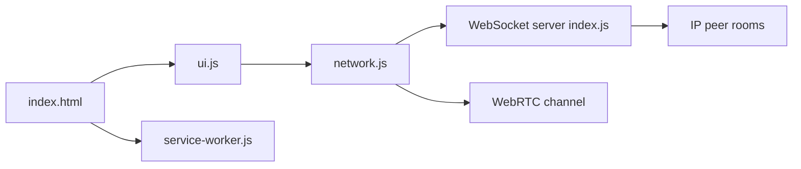

# SnapDrop/snapdrop

> Partage de fichiers entre appareils du même réseau via le navigateur, façon AirDrop.

## Le problème
Envoyer un fichier d'un téléphone à un ordinateur sans câble, compte ni application dédiée.

## Ce que ça fait vraiment
Le serveur Node regroupe les clients par IP publique et relaie la signalisation WebSocket ; les navigateurs négocient ensuite un canal WebRTC et s'envoient fichiers ou texte, découpés en morceaux. Application web installable (service worker). Le projet a été racheté par LimeWire ; le dépôt reste figé pour la version « classique » à héberger soi-même.

## Comment c'est branché


## Essayer
```bash
# Aucune commande exacte dans le README : il indique seulement
# qu'on peut héberger sa propre instance avec Docker.
```

## Coût et pièges
Licence GPL-3.0. Dernier push en février 2025, 287 issues ouvertes ; le service public est désormais celui de LimeWire (stockage, outils IA, comptes).

## Ce que ce n'est pas
Ni un service de stockage ni un outil maintenu activement : le dépôt « reste tel quel ».

## Alternatives
snapdrop.net / limewire.com : service commercial qui a repris le projet.

## Pour toi
Dépannage ponctuel sur réseau local ; aucun apport pour un workflow data/IA.

