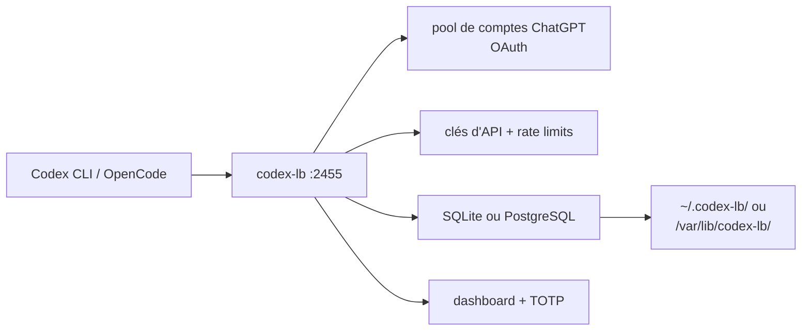

# Soju06/codex-lb

> Répartiteur de charge pour comptes ChatGPT, avec suivi d'usage et tableau de bord, pour usage personnel.

## Le problème
Un seul compte ChatGPT atteint vite ses limites de débit, et on ne sait pas ce qu'on consomme.
Pointer plusieurs clients différents vers plusieurs comptes demande de la plomberie.

## Ce que ça fait vraiment
Pooling de comptes avec répartition de charge, suivi par compte (tokens, coût, tendance sur 28 jours),
clés d'API internes avec limites par token, coût, fenêtre et modèle.
Authentification du dashboard par mot de passe et TOTP optionnel. Endpoints compatibles OpenAI,
donc utilisables par Codex CLI/IDE, OpenCode, OpenClaw, Hermes Agent et le SDK Python.
Synchronisation automatique de la liste des modèles disponibles en amont.

## Comment c'est branché


## Essayer
```bash
docker volume create codex-lb-data
docker network create codex-lb-net
docker run -d --name codex-lb --network codex-lb-net -p 2455:2455 -p 1455:1455 -v codex-lb-data:/var/lib/codex-lb ghcr.io/soju06/codex-lb:latest
uvx codex-lb
nix run github:Soju06/codex-lb
```

## Coût et pièges
Le logiciel est gratuit ; il suppose plusieurs comptes ChatGPT payants. Un jeton de bootstrap
à usage unique est exigé pour le premier accès distant au dashboard. SQLite par défaut,
PostgreSQL via `CODEX_LB_DATABASE_URL`. Sauvegarder le répertoire de données.

## Ce que ce n'est pas
Ce n'est pas un fournisseur de modèles ni une passerelle multi-éditeurs : c'est un proxy vers ChatGPT.
Ce n'est pas un usage prévu par le fournisseur amont — mutualiser des comptes d'abonnement
est un risque contractuel que le README n'aborde pas.

## Alternatives
Aucune nommée dans le README.

## Pour toi
À écarter en cadre professionnel ; l'idée à retenir est le suivi d'usage par clé, pas le pooling de comptes.
