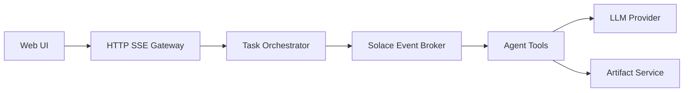

# SolaceLabs/solace-agent-mesh

> Framework Python déprécié pour systèmes multi-agents pilotés par événements, sur le courtier Solace.

## Le problème
Faire coopérer plusieurs agents spécialisés sans couplage fort, avec une messagerie d'événements.

## Ce que ça fait vraiment
Hôte d'agents A2A qui combine Google ADK et Solace AI Connector : orchestrateur qui délègue, passerelle HTTP/SSE avec interface web, Slack et REST, outils SQL/JQ/visualisation, embeds dynamiques, gestion d'artefacts, workflows, planificateur et plugins. Commandes `sam init`, `sam run`, `sam add agent`.

## Comment c'est branché


## Essayer
```bash
pip3 install solace-agent-mesh
sam init --gui
sam run
```

## Coût et pièges
Le dépôt est archivé et la version Python est dépréciée : plus de fonctions, corrections ni mises à jour de sécurité. Nécessite un courtier Solace et une clé de fournisseur LLM.

## Ce que ce n'est pas
Ce n'est plus la version à suivre : le README renvoie vers une nouvelle version et une application bureau gratuite, hors de ce dépôt.

## Alternatives
Le README renvoie vers la nouvelle version de Solace Agent Mesh (documentation Solace).

## Pour toi
À ignorer : archivé et déprécié, sans correctifs de sécurité ; ne pas démarrer de projet dessus.
