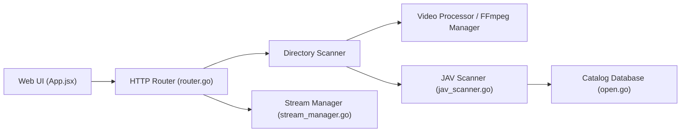

# Solr159/JavBoss

> Gestionnaire local de bibliothèque vidéo, avec mode spécialisé pour les vidéos pour adultes japonaises, en chinois.

## Le problème
Cataloguer, récupérer les métadonnées et lire de gros volumes de vidéos locales demande de combiner plusieurs logiciels.

## Ce que ça fait vraiment
Serveur Go avec interface React : il scanne les dossiers, génère des vignettes (ffmpeg), récupère des métadonnées auprès de sites tiers, gère étiquettes et favoris, et lit en navigateur ou via MPV. Extension Chrome pour la saisie assistée et le téléchargement de liens magnet via CloudDrive2. Modes « vidéo » et « JAV ».

## Comment c'est branché


## Essayer
```bash
curl -fsSL https://raw.githubusercontent.com/Solr159/JavBoss/main/scripts/install.sh | bash
docker compose up -d
```

## Coût et pièges
Le mot de passe par défaut est `admin`. Le compose donné monte tout le système hôte (`/:/host`) en réseau hôte. Le scrapage touche des sites externes, avec environ 1 % d'échecs par passe selon l'auteur. README uniquement en chinois.

## Ce que ce n'est pas
Un projet d'apprentissage du Go, sans usage commercial permis par son avertissement. Rien à voir avec la donnée ou l'IA ; le contenu géré est pour adultes.

## Alternatives
Aucune alternative nommée dans le README.

## Pour toi
À ignorer : logiciel de bibliothèque multimédia sans lien avec ton métier, monté avec des droits larges sur l'hôte, sous GPL-3.0.
