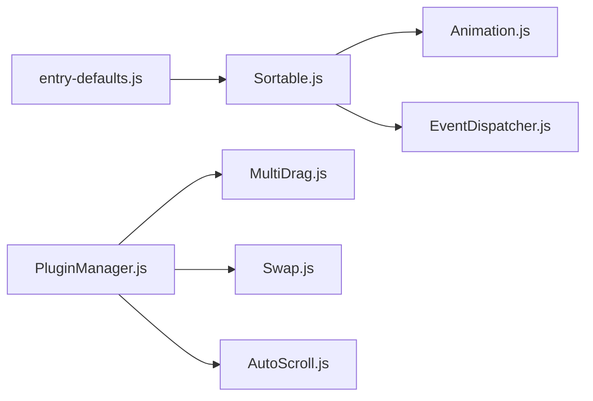

# SortableJS/Sortable

> Bibliothèque JavaScript de listes réordonnables par glisser-déposer, pour développeurs front-end.

## Le problème
Le glisser-déposer natif HTML5 est pénible à gérer : tactile, animations, listes multiples, défilement automatique.

## Ce que ça fait vraiment
Crée un objet `Sortable` sur une liste DOM : déplacement dans une liste ou entre listes (`group`, `pull`, `put`), clonage, poignée, filtre, animations CSS, tactile, sans jQuery. Plugins AutoScroll et OnSpill (par défaut), MultiDrag et Swap (extras). L'ordre peut être sauvegardé via `store` ; des événements (`onEnd`, `onUpdate`, `onSort`…) notifient les changements. Intégrations citées : React, Vue, Angular, Meteor, Knockout, Polymer, Ember.

## Comment c'est branché


## Essayer
```bash
npm install sortablejs --save
```
```js
var el = document.getElementById('items');
var sortable = Sortable.create(el);
```

## Coût et pièges
Gratuit. Le README signale des limites : `delay` impossible avec le glisser-déposer natif sur IE/Edge ; `touchStartThreshold` à régler sur certains téléphones très sensibles.

## Ce que ce n'est pas
Ce n'est pas un composant prêt à l'emploi avec interface : il ne gère que le comportement de réordonnancement ; données et persistance restent à ta charge.

## Alternatives
- html5sortable (voidberg) : cité dans le README, que Sortable dit surpasser sur la sélection de texte.

## Pour toi
Adopter si tu construis un outil d'annotation ou un tableau de bord web : brique petite et stable, MIT, sans dépendance obligatoire.

