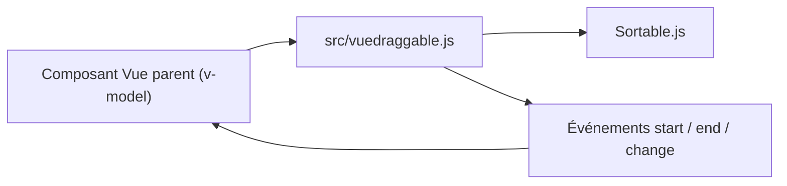

# SortableJS/Vue.Draggable

> Composant Vue 2 de glisser-déposer, synchronisé avec un tableau, basé sur Sortable.js.

## Le problème
Réordonner des listes par glisser-déposer en gardant le modèle de données de Vue synchronisé avec le DOM.

## Ce que ça fait vraiment
Le composant `draggable` enveloppe Sortable.js et se lie à un tableau via `v-model` ou `list`. Il gère les listes croisées, les poignées, le tactile, le clonage, les slots d'en-tête et de pied, `transition-group`, Vuex et l'enrobage de composants d'autres bibliothèques (via `tag` et `componentData`). Il émet les événements Sortable et un événement `change`.

## Comment c'est branché


## Essayer
```bash
yarn add vuedraggable
npm i -S vuedraggable
```

## Coût et pièges
Gratuit. Cible Vue 2 ; le README renvoie à `vue.draggable.next` pour Vue 3. Dernier push le 2024-03-04, plus d'un an. Ne pas confondre `vuedraggable` (Vue 2) et `vue-draggable` (Vue 1). Les clés `v-for` doivent refléter le contenu, pas l'index.

## Ce que ce n'est pas
Pas une version pour Vue 3. Les slots d'en-tête et de pied ne marchent pas avec `transition-group`.

## Alternatives
`vue.draggable.next` pour Vue 3 (nommé dans le README).

## Pour toi
Ignorer : composant Vue 2 ancien sans rapport avec la donnée ou l'IA ; si le besoin apparaît en Vue 3, passer par la version dédiée.

