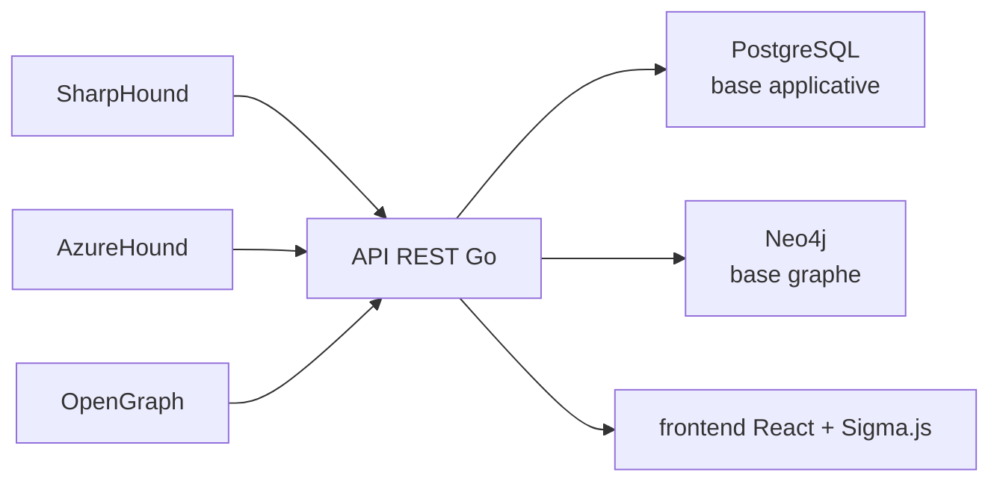

# SpecterOps/BloodHound

> Application web qui cartographie en graphe les chemins de privilèges d'un annuaire, pour red et blue teams.

## Le problème
Les relations de privilèges dans Active Directory, Azure ou un autre IAM sont invisibles à l'œil nu.
Un chemin d'attaque en quatre sauts est impossible à trouver manuellement.

## Ce que ça fait vraiment
Frontend React embarqué (Sigma.js) et API REST Go, sur une base applicative PostgreSQL et un graphe Neo4j.
Les données viennent des collecteurs SharpHound et AzureHound.
OpenGraph étend l'analyse au-delà d'AD et Azure, à d'autres plateformes d'identité.
Les attaquants y trouvent des chemins ; les défenseurs y trouvent quoi corriger.

## Comment c'est branché

## Essayer
Aucune commande dans le README : il renvoie au Quickstart Community Edition et à un exemple
Docker Compose.

## Coût et pièges
BloodHound CE est gratuit sous Apache-2.0 ; BloodHound Enterprise est le produit payant du même éditeur.
Il faut faire tourner PostgreSQL et Neo4j, et collecter des données d'annuaire — donnée sensible par nature.

## Ce que ce n'est pas
Ce n'est pas un scanner de vulnérabilités ni un outil d'exploitation : il révèle des relations.
Ce n'est pas monofichier — c'est une application monolithique avec deux bases de données.
Le collecteur n'est pas dans ce dépôt.

## Alternatives
Aucune nommée ; seul BloodHound Enterprise, la version commerciale, est cité.

## Pour toi
Sans rapport avec un pipeline data ; à retenir si tu dois auditer les privilèges de ton annuaire.
