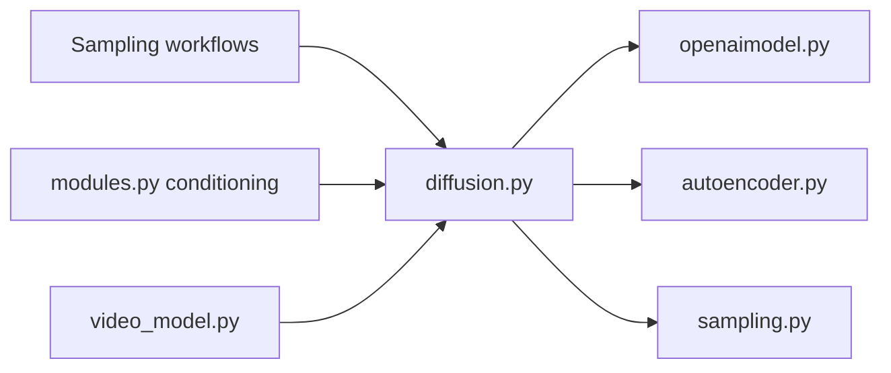

# Stability-AI/generative-models

> Code piloté par config pour entraîner et échantillonner des modèles de diffusion (SDXL, SV3D, SV4D), pour chercheurs.

## Le problème
Assembler un modèle de diffusion (réseau, conditionnement, perte, échantillonneur) à la main est long et peu reproductible.

## Ce que ça fait vraiment
Chaque module est instancié via `instantiate_from_config()` à partir de fichiers yaml dans `configs/`. Le dépôt fournit une démo Streamlit (`scripts/demo/sampling.py`) pour SDXL, un entraînement via `main.py --base`, un détecteur de filigrane invisible, et des workflows image vers vidéo SV3D et vidéo vers 4D SV4D/SV4D 2.0 (selon l'architecture décrite). Les poids SDXL-1.0 sont sous licence CreativeML Open RAIL++-M, ceux de SDXL-0.9 sous licence de recherche.

## Comment c'est branché


## Essayer
```bash
git clone https://github.com/Stability-AI/generative-models.git
cd generative-models
python3 -m venv .pt2
source .pt2/bin/activate
pip3 install torch torchvision torchaudio --index-url https://download.pytorch.org/whl/cu118
pip3 install -r requirements/pt2.txt
pip3 install .
streamlit run scripts/demo/sampling.py --server.port <your_port>
```

## Coût et pièges
GPU nécessaire ; testé sous Python 3.10. Les poids se téléchargent sur Hugging Face (accès sur demande pour 0.9). Le paquet ne déclare pas ses dépendances.

## Ce que ce n'est pas
Ce n'est pas un service prêt à l'emploi : pas de poids inclus dans le dépôt. Le code est MIT, mais les poids ont leurs propres licences.

## Alternatives
Non documenté : le README ne nomme pas d'alternative.

## Pour toi
Surveiller : utile pour comprendre une architecture de diffusion configurable, mais dernier push en décembre 2025 et poids sous licences séparées à lire avant usage.

