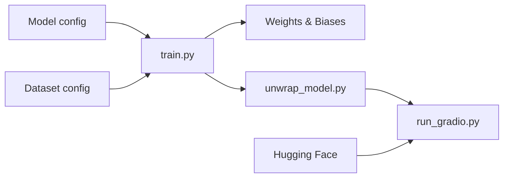

# Stability-AI/stable-audio-tools

> Code d'entraînement et d'inférence pour modèles de génération audio, pour chercheurs et ingénieurs audio.

## Le problème
Entraîner ou affiner des modèles audio (autoencodeurs, diffusion) exige beaucoup de plomberie de configuration.

## Ce que ça fait vraiment
Pilotage par fichiers JSON (modèle, jeu de données) : `train.py` lance l'entraînement PyTorch Lightning multi-GPU, `unwrap_model.py` retire l'enveloppe d'entraînement, `run_gradio.py` sert une démo. Jeux de données locaux ou WebDataset sur S3, suivi Weights & Biases.

## Comment c'est branché


## Essayer
```bash
git clone https://github.com/Stability-AI/stable-audio-tools.git
cd stable-audio-tools
uv sync --extra train --extra ui
uv run python run_gradio.py --pretrained-name stabilityai/stable-audio-open-1.0
```

## Coût et pièges
PyTorch ≥ 2.5, Flash Attention recommandé. Compte Weights & Biases exigé pour l'entraînement ; termes du modèle à accepter sur Hugging Face.

## Ce que ce n'est pas
Pas un produit clé en main : sections dépannage et contribution encore à faire.

## Alternatives
- Aucune alternative citée dans le README.

## Pour toi
À surveiller : base solide si tu fais de l'audio génératif ; sinon sans objet.

