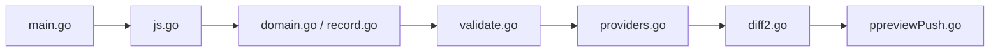

# StackExchange/dnscontrol

> Infrastructure as code pour le DNS : décrire les zones en JavaScript et les pousser vers plusieurs fournisseurs.

## Le problème
Modifier le DNS via des portails web ou des fichiers BIND est sujet aux erreurs et peu reproductible.

## Ce que ça fait vraiment
Lit `dnsconfig.js`, calcule les écarts avec chaque fournisseur (`preview`) puis les applique (`push`). Un même jeu d'enregistrements peut partir vers plusieurs fournisseurs (Route 53, Cloudflare, Gandi…), avec variables, macros et transformations. `dnscontrol init` génère une configuration de départ. Fonctionne partout où Go tourne, et en conteneur.

## Comment c'est branché


## Essayer
```bash
docker run --rm -it -v "$(pwd):/dns"  ghcr.io/dnscontrol/dnscontrol preview
```
Le README cite aussi `dnscontrol init` et `dnscontrol push`.

## Coût et pièges
Gratuit. Les fournisseurs NAMEDOTCOM, OPENSRS et SOFTLAYER n'ont plus de mainteneur. Un changement incompatible de `REV()` (RFC2317 vers RFC4183) est annoncé après la v5.0.

## Ce que ce n'est pas
Pas un serveur DNS : il configure des fournisseurs externes via leurs API.

## Alternatives
Aucune alternative citée dans le README.

## Pour toi
À ignorer sauf si tu gères toi-même des zones DNS : bon outil, mais hors du périmètre data/IA.

