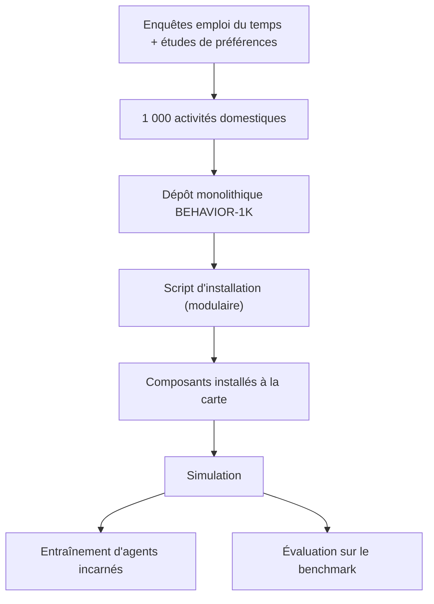

# StanfordVL/BEHAVIOR-1K

> Benchmark de simulation couvrant 1 000 activités domestiques pour agents incarnés.

## Le problème
Évaluer un agent incarné sur des tâches réalistes demande un simulateur, des scènes, des
objets et des définitions de tâches cohérentes — chacun en réécrit une version incompatible.

## Ce que ça fait vraiment
Le README tient en quelques lignes. Il présente un dépôt monolithique fournissant tout le
nécessaire pour entraîner et évaluer des agents sur mille activités quotidiennes de type
ménage, cuisine et rangement. Le point notable est la provenance des tâches : elles sont
sélectionnées à partir d'enquêtes réelles sur l'emploi du temps des personnes et d'études de
préférences, pas choisies arbitrairement par les auteurs. L'installation passe par un script
fourni qui gère toutes les dépendances et tous les composants, avec une installation modulaire
permettant de n'installer que ce dont on a besoin. Le reste — liste des tâches, simulateur,
protocole d'évaluation — est renvoyé vers le site principal et le guide d'installation.

## Comment c'est branché

## Essayer
Aucune commande n'est donnée dans le README : il indique seulement qu'un script d'installation
existe et renvoie au guide d'installation.

## Coût et pièges
Gratuit. Un benchmark de simulation incarnée suppose du GPU et un volume d'assets conséquent,
mais le README ne chiffre rien : ni matériel requis, ni taille sur disque, ni durée d'exécution.
L'installation modulaire est le seul levier mentionné pour limiter l'empreinte.

## Ce que ce n'est pas
Ce README ne suffit pas à juger : matière insuffisante. Il ne dit rien du simulateur sous-jacent,
du format des tâches, des métriques, ni de la licence. Ce n'est pas un modèle ni une
bibliothèque d'apprentissage — c'est un banc d'essai.

## Alternatives
- Aucune alternative nommée dans le README.

## Pour toi
À ouvrir seulement si tu travailles sur l'IA incarnée ; sinon, rien d'exploitable ici.
